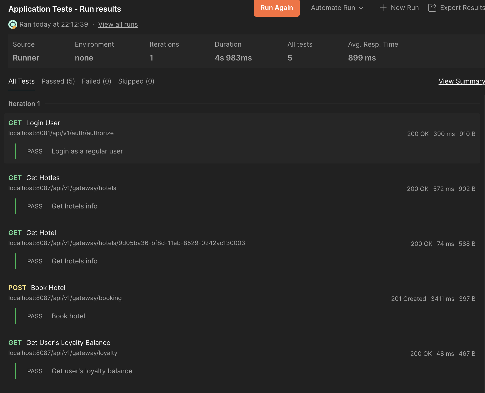
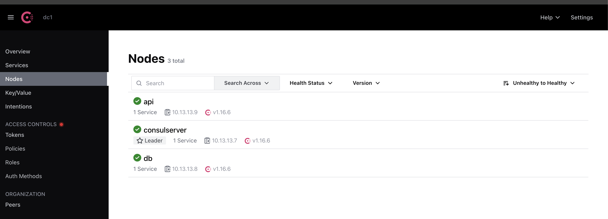

## Part 1. Удаленное конфигурирование узла через Ansible

### Создать с помощью Vagrant три машины - manager, node01, node02. Не устанавливать с помощью shell-скриптов docker при создании машин на Vagrant! Прокинуть порты node01 на локальную машину для доступа к пока еще не развернутому микросервисному приложению.


Написал Vagrantfile

Поднял машины через `vagrant up`


<details>
<summary>Посмотреть лог поднятия</summary>
<pre>
Bringing machine 'manager' up with 'qemu' provider...
Bringing machine 'worker' up with 'qemu' provider...
Bringing machine 'worker2' up with 'qemu' provider...
==> worker: Checking if box 'perk/ubuntu-20.04-arm64' version '20230420' is up to date...
==> worker: Importing a QEMU instance
    worker: Creating and registering the VM...
    worker: Successfully imported VM
==> worker: Warning! The QEMU provider doesn't support any of the Vagrant
==> worker: high-level network configurations (`config.vm.network`). They
==> worker: will be silently ignored.
==> worker: Starting the instance...
==> worker: Waiting for machine to boot. This may take a few minutes...
    worker: SSH address: 127.0.0.1:50001
    worker: SSH username: vagrant
    worker: SSH auth method: private key
==> worker2: Checking if box 'perk/ubuntu-20.04-arm64' version '20230420' is up to date...
==> worker2: Importing a QEMU instance
    worker2: Creating and registering the VM...
    worker2: Successfully imported VM
==> worker2: Warning! The QEMU provider doesn't support any of the Vagrant
==> worker2: high-level network configurations (`config.vm.network`). They
==> worker2: will be silently ignored.
==> worker2: Starting the instance...
==> worker2: Waiting for machine to boot. This may take a few minutes...
    worker2: SSH address: 127.0.0.1:50002
    worker2: SSH username: vagrant
    worker2: SSH auth method: private key
==> manager: Checking if box 'perk/ubuntu-20.04-arm64' version '20230420' is up to date...
==> manager: Importing a QEMU instance
    manager: Creating and registering the VM...
    manager: Successfully imported VM
==> manager: Warning! The QEMU provider doesn't support any of the Vagrant
==> manager: high-level network configurations (`config.vm.network`). They
==> manager: will be silently ignored.
==> manager: Starting the instance...
==> manager: Waiting for machine to boot. This may take a few minutes...
    manager: SSH address: 127.0.0.1:50000
    manager: SSH username: vagrant
    manager: SSH auth method: private key
    worker: Warning: Connection reset. Retrying...
    worker2: Warning: Connection reset. Retrying...
    worker: Warning: Remote connection disconnect. Retrying...
    worker2: Warning: Remote connection disconnect. Retrying...
    manager: Warning: Connection reset. Retrying...
    manager: Warning: Remote connection disconnect. Retrying...
    worker:
    worker: Vagrant insecure key detected. Vagrant will automatically replace
    worker: this with a newly generated keypair for better security.
    manager:
    manager: Vagrant insecure key detected. Vagrant will automatically replace
    manager: this with a newly generated keypair for better security.
    worker:
    worker: Inserting generated public key within guest...
    worker: Removing insecure key from the guest if it's present...
    worker: Key inserted! Disconnecting and reconnecting using new SSH key...
    manager:
    manager: Inserting generated public key within guest...
    manager: Removing insecure key from the guest if it's present...
    manager: Key inserted! Disconnecting and reconnecting using new SSH key...
    worker2:
    worker2: Vagrant insecure key detected. Vagrant will automatically replace
    worker2: this with a newly generated keypair for better security.
==> worker: Machine booted and ready!
==> worker: Setting hostname...
    worker2:
    worker2: Inserting generated public key within guest...
    worker2: Removing insecure key from the guest if it's present...
    worker2: Key inserted! Disconnecting and reconnecting using new SSH key...
==> worker: Running provisioner: shell...
    worker: Running: inline script
==> worker: Running provisioner: shell...
    worker: Running: inline script
==> manager: Machine booted and ready!
==> manager: Setting hostname...
==> manager: Rsyncing folder: /Users/kirillosin/DevOps_8-1/src/ansible/ => /vagrant
    worker: Hit:1 http://ports.ubuntu.com/ubuntu-ports focal InRelease
    worker: Get:2 http://ports.ubuntu.com/ubuntu-ports focal-updates InRelease [128 kB]
==> manager: Running provisioner: shell...
    manager: Running: inline script
==> manager: Running provisioner: shell...
    manager: Running: inline script
    worker: Get:3 http://ports.ubuntu.com/ubuntu-ports focal-backports InRelease [128 kB]
    worker: Get:4 http://ports.ubuntu.com/ubuntu-ports focal-security InRelease [128 kB]
    worker: Get:5 http://ports.ubuntu.com/ubuntu-ports focal/universe arm64 Packages [8458 kB]
==> worker2: Machine booted and ready!
==> worker2: Setting hostname...
    manager: Hit:1 http://ports.ubuntu.com/ubuntu-ports focal InRelease
    manager: Get:2 http://ports.ubuntu.com/ubuntu-ports focal-updates InRelease [128 kB]
==> worker2: Running provisioner: shell...
    worker2: Running: inline script
==> worker2: Running provisioner: shell...
    worker: Get:6 http://ports.ubuntu.com/ubuntu-ports focal/universe Translation-en [5124 kB]
    worker2: Running: inline script
    manager: Get:3 http://ports.ubuntu.com/ubuntu-ports focal-backports InRelease [128 kB]
    worker: Get:7 http://ports.ubuntu.com/ubuntu-ports focal/universe arm64 c-n-f Metadata [255 kB]
    worker: Get:8 http://ports.ubuntu.com/ubuntu-ports focal/multiverse arm64 Packages [114 kB]
    worker: Get:9 http://ports.ubuntu.com/ubuntu-ports focal/multiverse Translation-en [104 kB]
    worker: Get:10 http://ports.ubuntu.com/ubuntu-ports focal/multiverse arm64 c-n-f Metadata [8024 B]
    worker: Get:11 http://ports.ubuntu.com/ubuntu-ports focal-updates/main arm64 Packages [2680 kB]
    worker2: Hit:1 http://ports.ubuntu.com/ubuntu-ports focal InRelease
    manager: Get:4 http://ports.ubuntu.com/ubuntu-ports focal-security InRelease [128 kB]
    worker2: Get:2 http://ports.ubuntu.com/ubuntu-ports focal-updates InRelease [128 kB]
    worker: Get:12 http://ports.ubuntu.com/ubuntu-ports focal-updates/main Translation-en [543 kB]
    manager: Get:5 http://ports.ubuntu.com/ubuntu-ports focal/universe arm64 Packages [8458 kB]
    worker2: Get:3 http://ports.ubuntu.com/ubuntu-ports focal-backports InRelease [128 kB]
    worker2: Get:4 http://ports.ubuntu.com/ubuntu-ports focal-security InRelease [128 kB]
    worker2: Get:5 http://ports.ubuntu.com/ubuntu-ports focal/universe arm64 Packages [8458 kB]
    worker: Get:13 http://ports.ubuntu.com/ubuntu-ports focal-updates/main arm64 c-n-f Metadata [17.3 kB]
    worker: Get:14 http://ports.ubuntu.com/ubuntu-ports focal-updates/restricted arm64 Packages [46.6 kB]
    worker: Get:15 http://ports.ubuntu.com/ubuntu-ports focal-updates/restricted Translation-en [442 kB]
    worker: Get:16 http://ports.ubuntu.com/ubuntu-ports focal-updates/restricted arm64 c-n-f Metadata [364 B]
    worker: Get:17 http://ports.ubuntu.com/ubuntu-ports focal-updates/universe arm64 Packages [1138 kB]
    manager: Get:6 http://ports.ubuntu.com/ubuntu-ports focal/universe Translation-en [5124 kB]
    worker: Get:18 http://ports.ubuntu.com/ubuntu-ports focal-updates/universe Translation-en [294 kB]
    manager: Get:7 http://ports.ubuntu.com/ubuntu-ports focal/universe arm64 c-n-f Metadata [255 kB]
    worker: Get:19 http://ports.ubuntu.com/ubuntu-ports focal-updates/universe arm64 c-n-f Metadata [25.8 kB]
    worker: Get:20 http://ports.ubuntu.com/ubuntu-ports focal-updates/multiverse arm64 Packages [10.7 kB]
    worker: Get:21 http://ports.ubuntu.com/ubuntu-ports focal-updates/multiverse Translation-en [7936 B]
    worker: Get:22 http://ports.ubuntu.com/ubuntu-ports focal-updates/multiverse arm64 c-n-f Metadata [436 B]
    manager: Get:8 http://ports.ubuntu.com/ubuntu-ports focal/multiverse arm64 Packages [114 kB]
    manager: Get:9 http://ports.ubuntu.com/ubuntu-ports focal/multiverse Translation-en [104 kB]
    manager: Get:10 http://ports.ubuntu.com/ubuntu-ports focal/multiverse arm64 c-n-f Metadata [8024 B]
    manager: Get:11 http://ports.ubuntu.com/ubuntu-ports focal-updates/main arm64 Packages [2680 kB]
    worker: Get:23 http://ports.ubuntu.com/ubuntu-ports focal-backports/main arm64 Packages [45.4 kB]
    worker2: Get:6 http://ports.ubuntu.com/ubuntu-ports focal/universe Translation-en [5124 kB]
    worker: Get:24 http://ports.ubuntu.com/ubuntu-ports focal-backports/main Translation-en [16.3 kB]
    worker: Get:25 http://ports.ubuntu.com/ubuntu-ports focal-backports/main arm64 c-n-f Metadata [1420 B]
    worker: Get:26 http://ports.ubuntu.com/ubuntu-ports focal-backports/restricted arm64 c-n-f Metadata [116 B]
    worker: Get:27 http://ports.ubuntu.com/ubuntu-ports focal-backports/universe arm64 Packages [24.3 kB]
    worker2: Get:7 http://ports.ubuntu.com/ubuntu-ports focal/universe arm64 c-n-f Metadata [255 kB]
    worker: Get:28 http://ports.ubuntu.com/ubuntu-ports focal-backports/universe Translation-en [16.3 kB]
    worker2: Get:8 http://ports.ubuntu.com/ubuntu-ports focal/multiverse arm64 Packages [114 kB]
    worker2: Get:9 http://ports.ubuntu.com/ubuntu-ports focal/multiverse Translation-en [104 kB]
    worker2: Get:10 http://ports.ubuntu.com/ubuntu-ports focal/multiverse arm64 c-n-f Metadata [8024 B]
    worker2: Get:11 http://ports.ubuntu.com/ubuntu-ports focal-updates/main arm64 Packages [2680 kB]
    worker: Get:29 http://ports.ubuntu.com/ubuntu-ports focal-backports/universe arm64 c-n-f Metadata [864 B]
    worker: Get:30 http://ports.ubuntu.com/ubuntu-ports focal-backports/multiverse arm64 c-n-f Metadata [116 B]
    worker: Get:31 http://ports.ubuntu.com/ubuntu-ports focal-security/main arm64 Packages [2384 kB]
    worker2: Get:12 http://ports.ubuntu.com/ubuntu-ports focal-updates/main Translation-en [543 kB]
    worker: Get:32 http://ports.ubuntu.com/ubuntu-ports focal-security/main Translation-en [464 kB]
    worker: Get:33 http://ports.ubuntu.com/ubuntu-ports focal-security/main arm64 c-n-f Metadata [13.8 kB]
    worker2: Get:13 http://ports.ubuntu.com/ubuntu-ports focal-updates/main arm64 c-n-f Metadata [17.3 kB]
    worker2: Get:14 http://ports.ubuntu.com/ubuntu-ports focal-updates/restricted arm64 Packages [46.6 kB]
    worker2: Get:15 http://ports.ubuntu.com/ubuntu-ports focal-updates/restricted Translation-en [442 kB]
    worker: Get:34 http://ports.ubuntu.com/ubuntu-ports focal-security/restricted arm64 Packages [46.3 kB]
    worker2: Get:16 http://ports.ubuntu.com/ubuntu-ports focal-updates/restricted arm64 c-n-f Metadata [364 B]
    worker2: Get:17 http://ports.ubuntu.com/ubuntu-ports focal-updates/universe arm64 Packages [1138 kB]
    worker2: Get:18 http://ports.ubuntu.com/ubuntu-ports focal-updates/universe Translation-en [294 kB]
    worker: Get:35 http://ports.ubuntu.com/ubuntu-ports focal-security/restricted Translation-en [425 kB]
    worker2: Get:19 http://ports.ubuntu.com/ubuntu-ports focal-updates/universe arm64 c-n-f Metadata [25.8 kB]
    worker2: Get:20 http://ports.ubuntu.com/ubuntu-ports focal-updates/multiverse arm64 Packages [10.7 kB]
    worker2: Get:21 http://ports.ubuntu.com/ubuntu-ports focal-updates/multiverse Translation-en [7936 B]
    worker2: Get:22 http://ports.ubuntu.com/ubuntu-ports focal-updates/multiverse arm64 c-n-f Metadata [436 B]
    worker2: Get:23 http://ports.ubuntu.com/ubuntu-ports focal-backports/main arm64 Packages [45.4 kB]
    worker: Get:36 http://ports.ubuntu.com/ubuntu-ports focal-security/restricted arm64 c-n-f Metadata [368 B]
    worker: Get:37 http://ports.ubuntu.com/ubuntu-ports focal-security/universe arm64 Packages [918 kB]
    worker: Get:38 http://ports.ubuntu.com/ubuntu-ports focal-security/universe Translation-en [212 kB]
    worker: Get:39 http://ports.ubuntu.com/ubuntu-ports focal-security/universe arm64 c-n-f Metadata [18.9 kB]
    worker: Get:40 http://ports.ubuntu.com/ubuntu-ports focal-security/multiverse arm64 Packages [5400 B]
    worker: Get:41 http://ports.ubuntu.com/ubuntu-ports focal-security/multiverse Translation-en [5968 B]
    worker: Get:42 http://ports.ubuntu.com/ubuntu-ports focal-security/multiverse arm64 c-n-f Metadata [220 B]
    manager: Get:12 http://ports.ubuntu.com/ubuntu-ports focal-updates/main Translation-en [543 kB]
    worker2: Get:24 http://ports.ubuntu.com/ubuntu-ports focal-backports/main Translation-en [16.3 kB]
    worker2: Get:25 http://ports.ubuntu.com/ubuntu-ports focal-backports/main arm64 c-n-f Metadata [1420 B]
    worker2: Get:26 http://ports.ubuntu.com/ubuntu-ports focal-backports/restricted arm64 c-n-f Metadata [116 B]
    worker2: Get:27 http://ports.ubuntu.com/ubuntu-ports focal-backports/universe arm64 Packages [24.3 kB]
    worker2: Get:28 http://ports.ubuntu.com/ubuntu-ports focal-backports/universe Translation-en [16.3 kB]
    worker2: Get:29 http://ports.ubuntu.com/ubuntu-ports focal-backports/universe arm64 c-n-f Metadata [864 B]
    worker2: Get:30 http://ports.ubuntu.com/ubuntu-ports focal-backports/multiverse arm64 c-n-f Metadata [116 B]
    worker2: Get:31 http://ports.ubuntu.com/ubuntu-ports focal-security/main arm64 Packages [2384 kB]
    manager: Get:13 http://ports.ubuntu.com/ubuntu-ports focal-updates/main arm64 c-n-f Metadata [17.3 kB]
    manager: Get:14 http://ports.ubuntu.com/ubuntu-ports focal-updates/restricted arm64 Packages [46.6 kB]
    manager: Get:15 http://ports.ubuntu.com/ubuntu-ports focal-updates/restricted Translation-en [442 kB]
    worker2: Get:32 http://ports.ubuntu.com/ubuntu-ports focal-security/main Translation-en [464 kB]
    worker2: Get:33 http://ports.ubuntu.com/ubuntu-ports focal-security/main arm64 c-n-f Metadata [13.8 kB]
    manager: Get:16 http://ports.ubuntu.com/ubuntu-ports focal-updates/restricted arm64 c-n-f Metadata [364 B]
    manager: Get:17 http://ports.ubuntu.com/ubuntu-ports focal-updates/universe arm64 Packages [1138 kB]
    worker2: Get:34 http://ports.ubuntu.com/ubuntu-ports focal-security/restricted arm64 Packages [46.3 kB]
    manager: Get:18 http://ports.ubuntu.com/ubuntu-ports focal-updates/universe Translation-en [294 kB]
    manager: Get:19 http://ports.ubuntu.com/ubuntu-ports focal-updates/universe arm64 c-n-f Metadata [25.8 kB]
    manager: Get:20 http://ports.ubuntu.com/ubuntu-ports focal-updates/multiverse arm64 Packages [10.7 kB]
    manager: Get:21 http://ports.ubuntu.com/ubuntu-ports focal-updates/multiverse Translation-en [7936 B]
    manager: Get:22 http://ports.ubuntu.com/ubuntu-ports focal-updates/multiverse arm64 c-n-f Metadata [436 B]
    worker2: Get:35 http://ports.ubuntu.com/ubuntu-ports focal-security/restricted Translation-en [425 kB]
    manager: Get:23 http://ports.ubuntu.com/ubuntu-ports focal-backports/main arm64 Packages [45.4 kB]
    worker2: Get:36 http://ports.ubuntu.com/ubuntu-ports focal-security/restricted arm64 c-n-f Metadata [368 B]
    worker2: Get:37 http://ports.ubuntu.com/ubuntu-ports focal-security/universe arm64 Packages [918 kB]
    manager: Get:24 http://ports.ubuntu.com/ubuntu-ports focal-backports/main Translation-en [16.3 kB]
    manager: Get:25 http://ports.ubuntu.com/ubuntu-ports focal-backports/main arm64 c-n-f Metadata [1420 B]
    manager: Get:26 http://ports.ubuntu.com/ubuntu-ports focal-backports/restricted arm64 c-n-f Metadata [116 B]
    manager: Get:27 http://ports.ubuntu.com/ubuntu-ports focal-backports/universe arm64 Packages [24.3 kB]
    manager: Get:28 http://ports.ubuntu.com/ubuntu-ports focal-backports/universe Translation-en [16.3 kB]
    manager: Get:29 http://ports.ubuntu.com/ubuntu-ports focal-backports/universe arm64 c-n-f Metadata [864 B]
    manager: Get:30 http://ports.ubuntu.com/ubuntu-ports focal-backports/multiverse arm64 c-n-f Metadata [116 B]
    manager: Get:31 http://ports.ubuntu.com/ubuntu-ports focal-security/main arm64 Packages [2384 kB]
    worker2: Get:38 http://ports.ubuntu.com/ubuntu-ports focal-security/universe Translation-en [212 kB]
    worker2: Get:39 http://ports.ubuntu.com/ubuntu-ports focal-security/universe arm64 c-n-f Metadata [18.9 kB]
    worker2: Get:40 http://ports.ubuntu.com/ubuntu-ports focal-security/multiverse arm64 Packages [5400 B]
    worker2: Get:41 http://ports.ubuntu.com/ubuntu-ports focal-security/multiverse Translation-en [5968 B]
    worker2: Get:42 http://ports.ubuntu.com/ubuntu-ports focal-security/multiverse arm64 c-n-f Metadata [220 B]
    manager: Get:32 http://ports.ubuntu.com/ubuntu-ports focal-security/main Translation-en [464 kB]
    manager: Get:33 http://ports.ubuntu.com/ubuntu-ports focal-security/main arm64 c-n-f Metadata [13.8 kB]
    manager: Get:34 http://ports.ubuntu.com/ubuntu-ports focal-security/restricted arm64 Packages [46.3 kB]
    manager: Get:35 http://ports.ubuntu.com/ubuntu-ports focal-security/restricted Translation-en [425 kB]
    manager: Get:36 http://ports.ubuntu.com/ubuntu-ports focal-security/restricted arm64 c-n-f Metadata [368 B]
    manager: Get:37 http://ports.ubuntu.com/ubuntu-ports focal-security/universe arm64 Packages [918 kB]
    manager: Get:38 http://ports.ubuntu.com/ubuntu-ports focal-security/universe Translation-en [212 kB]
    manager: Get:39 http://ports.ubuntu.com/ubuntu-ports focal-security/universe arm64 c-n-f Metadata [18.9 kB]
    manager: Get:40 http://ports.ubuntu.com/ubuntu-ports focal-security/multiverse arm64 Packages [5400 B]
    manager: Get:41 http://ports.ubuntu.com/ubuntu-ports focal-security/multiverse Translation-en [5968 B]
    manager: Get:42 http://ports.ubuntu.com/ubuntu-ports focal-security/multiverse arm64 c-n-f Metadata [220 B]
    worker: Fetched 24.2 MB in 4s (5992 kB/s)
    worker: Reading package lists...
    worker: Reading package lists...
    worker: Building dependency tree...
    worker: Reading state information...
    worker: The following additional packages will be installed:
    worker:   libjq1 libonig5 wireguard-tools
    worker: The following NEW packages will be installed:
    worker:   jq libjq1 libonig5 resolvconf wireguard wireguard-tools
    worker: 0 upgraded, 6 newly installed, 0 to remove and 166 not upgraded.
    worker: Need to get 435 kB of archives.
    worker: After this operation, 1553 kB of additional disk space will be used.
    worker: Get:1 http://ports.ubuntu.com/ubuntu-ports focal/universe arm64 libonig5 arm64 6.9.4-1 [134 kB]
    worker: Get:2 http://ports.ubuntu.com/ubuntu-ports focal-updates/universe arm64 libjq1 arm64 1.6-1ubuntu0.20.04.1 [107 kB]
    worker2: Fetched 24.2 MB in 4s (6643 kB/s)
    worker: Get:3 http://ports.ubuntu.com/ubuntu-ports focal-updates/universe arm64 jq arm64 1.6-1ubuntu0.20.04.1 [49.6 kB]
    worker: Get:4 http://ports.ubuntu.com/ubuntu-ports focal-updates/universe arm64 wireguard-tools arm64 1.0.20200513-1~20.04.2 [86.3 kB]
    worker: Get:5 http://ports.ubuntu.com/ubuntu-ports focal-updates/universe arm64 wireguard all 1.0.20200513-1~20.04.2 [3264 B]
    worker: Get:6 http://ports.ubuntu.com/ubuntu-ports focal/universe arm64 resolvconf all 1.82 [54.7 kB]
    worker: dpkg-preconfigure: unable to re-open stdin: No such file or directory
    worker: Fetched 435 kB in 0s (992 kB/s)
    worker: Selecting previously unselected package libonig5:arm64.
(Reading database ... 64772 files and directories currently installed.)
    worker: Preparing to unpack .../0-libonig5_6.9.4-1_arm64.deb ...
    worker: Unpacking libonig5:arm64 (6.9.4-1) ...
    worker: Selecting previously unselected package libjq1:arm64.
    worker: Preparing to unpack .../1-libjq1_1.6-1ubuntu0.20.04.1_arm64.deb ...
    worker: Unpacking libjq1:arm64 (1.6-1ubuntu0.20.04.1) ...
    worker: Selecting previously unselected package jq.
    worker: Preparing to unpack .../2-jq_1.6-1ubuntu0.20.04.1_arm64.deb ...
    worker: Unpacking jq (1.6-1ubuntu0.20.04.1) ...
    worker: Selecting previously unselected package wireguard-tools.
    worker: Preparing to unpack .../3-wireguard-tools_1.0.20200513-1~20.04.2_arm64.deb ...
    worker: Unpacking wireguard-tools (1.0.20200513-1~20.04.2) ...
    worker: Selecting previously unselected package wireguard.
    worker: Preparing to unpack .../4-wireguard_1.0.20200513-1~20.04.2_all.deb ...
    worker: Unpacking wireguard (1.0.20200513-1~20.04.2) ...
    worker: Selecting previously unselected package resolvconf.
    worker: Preparing to unpack .../5-resolvconf_1.82_all.deb ...
    worker: Unpacking resolvconf (1.82) ...
    worker: Setting up resolvconf (1.82) ...
    worker2: Reading package lists...
    worker2: Reading package lists...
    worker: Created symlink /etc/systemd/system/sysinit.target.wants/resolvconf.service → /lib/systemd/system/resolvconf.service.
    worker2: Building dependency tree...
    worker2: Reading state information...
    worker2: The following additional packages will be installed:
    worker2:   libjq1 libonig5 wireguard-tools
    worker2: The following NEW packages will be installed:
    worker2:   jq libjq1 libonig5 resolvconf wireguard wireguard-tools
    worker2: 0 upgraded, 6 newly installed, 0 to remove and 166 not upgraded.
    worker2: Need to get 435 kB of archives.
    worker2: After this operation, 1553 kB of additional disk space will be used.
    worker2: Get:1 http://ports.ubuntu.com/ubuntu-ports focal/universe arm64 libonig5 arm64 6.9.4-1 [134 kB]
    worker: Created symlink /etc/systemd/system/systemd-resolved.service.wants/resolvconf-pull-resolved.path → /lib/systemd/system/resolvconf-pull-resolved.path.
    manager: Fetched 24.2 MB in 5s (4538 kB/s)
    worker2: Get:2 http://ports.ubuntu.com/ubuntu-ports focal-updates/universe arm64 libjq1 arm64 1.6-1ubuntu0.20.04.1 [107 kB]
    worker: resolvconf-pull-resolved.service is a disabled or a static unit, not starting it.
    worker2: Get:3 http://ports.ubuntu.com/ubuntu-ports focal-updates/universe arm64 jq arm64 1.6-1ubuntu0.20.04.1 [49.6 kB]
    worker: Setting up wireguard-tools (1.0.20200513-1~20.04.2) ...
    worker2: Get:4 http://ports.ubuntu.com/ubuntu-ports focal-updates/universe arm64 wireguard-tools arm64 1.0.20200513-1~20.04.2 [86.3 kB]
    worker2: Get:5 http://ports.ubuntu.com/ubuntu-ports focal-updates/universe arm64 wireguard all 1.0.20200513-1~20.04.2 [3264 B]
    worker2: Get:6 http://ports.ubuntu.com/ubuntu-ports focal/universe arm64 resolvconf all 1.82 [54.7 kB]
    worker: wg-quick.target is a disabled or a static unit, not starting it.
    worker: Setting up libonig5:arm64 (6.9.4-1) ...
    worker: Setting up wireguard (1.0.20200513-1~20.04.2) ...
    worker: Setting up libjq1:arm64 (1.6-1ubuntu0.20.04.1) ...
    worker: Setting up jq (1.6-1ubuntu0.20.04.1) ...
    worker: Processing triggers for systemd (245.4-4ubuntu3.21) ...
    worker2: dpkg-preconfigure: unable to re-open stdin: No such file or directory
    worker2: Fetched 435 kB in 0s (999 kB/s)
    worker2: Selecting previously unselected package libonig5:arm64.
(Reading database ... 64772 files and directories currently installed.)
    worker2: Preparing to unpack .../0-libonig5_6.9.4-1_arm64.deb ...
    worker2: Unpacking libonig5:arm64 (6.9.4-1) ...
    worker: Processing triggers for man-db (2.9.1-1) ...
    worker2: Selecting previously unselected package libjq1:arm64.
    worker2: Preparing to unpack .../1-libjq1_1.6-1ubuntu0.20.04.1_arm64.deb ...
    worker2: Unpacking libjq1:arm64 (1.6-1ubuntu0.20.04.1) ...
    worker2: Selecting previously unselected package jq.
    worker2: Preparing to unpack .../2-jq_1.6-1ubuntu0.20.04.1_arm64.deb ...
    worker2: Unpacking jq (1.6-1ubuntu0.20.04.1) ...
    worker2: Selecting previously unselected package wireguard-tools.
    worker2: Preparing to unpack .../3-wireguard-tools_1.0.20200513-1~20.04.2_arm64.deb ...
    worker2: Unpacking wireguard-tools (1.0.20200513-1~20.04.2) ...
    worker: Processing triggers for libc-bin (2.31-0ubuntu9.9) ...
    worker2: Selecting previously unselected package wireguard.
    worker2: Preparing to unpack .../4-wireguard_1.0.20200513-1~20.04.2_all.deb ...
    worker2: Unpacking wireguard (1.0.20200513-1~20.04.2) ...
    worker2: Selecting previously unselected package resolvconf.
    worker2: Preparing to unpack .../5-resolvconf_1.82_all.deb ...
    worker2: Unpacking resolvconf (1.82) ...
    worker: Processing triggers for resolvconf (1.82) ...
    manager: Reading package lists...
    worker2: Setting up resolvconf (1.82) ...
    manager: Reading package lists...
    manager: Building dependency tree...
    manager: Reading state information...
    worker2: Created symlink /etc/systemd/system/sysinit.target.wants/resolvconf.service → /lib/systemd/system/resolvconf.service.
    manager: The following additional packages will be installed:
    manager:   ieee-data libjq1 libonig5 python3-argcomplete python3-crypto
    manager:   python3-dnspython python3-jmespath python3-kerberos python3-libcloud
    manager:   python3-lockfile python3-netaddr python3-ntlm-auth python3-requests-kerberos
    manager:   python3-requests-ntlm python3-selinux python3-winrm python3-xmltodict
    manager:   wireguard-tools
    manager: Suggested packages:
    manager:   cowsay sshpass python-lockfile-doc ipython3 python-netaddr-docs
    manager: The following NEW packages will be installed:
    manager:   ansible ieee-data jq libjq1 libonig5 python3-argcomplete python3-crypto
    manager:   python3-dnspython python3-jmespath python3-kerberos python3-libcloud
    manager:   python3-lockfile python3-netaddr python3-ntlm-auth python3-requests-kerberos
    manager:   python3-requests-ntlm python3-selinux python3-winrm python3-xmltodict
    manager:   resolvconf wireguard wireguard-tools
    manager: 0 upgraded, 22 newly installed, 0 to remove and 166 not upgraded.
    manager: Need to get 10.1 MB of archives.
    manager: After this operation, 91.6 MB of additional disk space will be used.
    manager: Get:1 http://ports.ubuntu.com/ubuntu-ports focal/main arm64 python3-crypto arm64 2.6.1-13ubuntu2 [237 kB]
    worker2: Created symlink /etc/systemd/system/systemd-resolved.service.wants/resolvconf-pull-resolved.path → /lib/systemd/system/resolvconf-pull-resolved.path.
    manager: Get:2 http://ports.ubuntu.com/ubuntu-ports focal-updates/main arm64 python3-dnspython all 1.16.0-1ubuntu1 [89.2 kB]
    manager: Get:3 http://ports.ubuntu.com/ubuntu-ports focal/main arm64 ieee-data all 20180805.1 [1589 kB]
    worker2: resolvconf-pull-resolved.service is a disabled or a static unit, not starting it.
    worker2: Setting up wireguard-tools (1.0.20200513-1~20.04.2) ...
    manager: Get:4 http://ports.ubuntu.com/ubuntu-ports focal-updates/main arm64 python3-netaddr all 0.7.19-3ubuntu1 [236 kB]
    manager: Get:5 http://ports.ubuntu.com/ubuntu-ports focal/universe arm64 ansible all 2.9.6+dfsg-1 [5794 kB]
    worker2: wg-quick.target is a disabled or a static unit, not starting it.
    worker2: Setting up libonig5:arm64 (6.9.4-1) ...
    worker2: Setting up wireguard (1.0.20200513-1~20.04.2) ...
    worker2: Setting up libjq1:arm64 (1.6-1ubuntu0.20.04.1) ...
    worker2: Setting up jq (1.6-1ubuntu0.20.04.1) ...
    worker2: Processing triggers for systemd (245.4-4ubuntu3.21) ...
    manager: Get:6 http://ports.ubuntu.com/ubuntu-ports focal/universe arm64 libonig5 arm64 6.9.4-1 [134 kB]
    manager: Get:7 http://ports.ubuntu.com/ubuntu-ports focal-updates/universe arm64 libjq1 arm64 1.6-1ubuntu0.20.04.1 [107 kB]
    worker2: Processing triggers for man-db (2.9.1-1) ...
    manager: Get:8 http://ports.ubuntu.com/ubuntu-ports focal-updates/universe arm64 jq arm64 1.6-1ubuntu0.20.04.1 [49.6 kB]
    manager: Get:9 http://ports.ubuntu.com/ubuntu-ports focal/universe arm64 python3-argcomplete all 1.8.1-1.3ubuntu1 [27.2 kB]
    manager: Get:10 http://ports.ubuntu.com/ubuntu-ports focal-updates/main arm64 python3-jmespath all 0.9.4-2ubuntu1 [21.5 kB]
    manager: Get:11 http://ports.ubuntu.com/ubuntu-ports focal/universe arm64 python3-kerberos arm64 1.1.14-3.1build1 [21.8 kB]
    worker2: Processing triggers for libc-bin (2.31-0ubuntu9.9) ...
    worker2: Processing triggers for resolvconf (1.82) ...
    manager: Get:12 http://ports.ubuntu.com/ubuntu-ports focal/main arm64 python3-lockfile all 1:0.12.2-2ubuntu2 [14.6 kB]
    manager: Get:13 http://ports.ubuntu.com/ubuntu-ports focal/universe arm64 python3-libcloud all 2.8.0-1 [1403 kB]
    worker: [#] ip link add wg0 type wireguard
    worker: [#] wg setconf wg0 /dev/fd/63
    worker: [#] ip -4 address add 10.13.13.2 dev wg0
    worker: [#] ip link set mtu 1420 up dev wg0
    worker: [#] resolvconf -a tun.wg0 -m 0 -x
    worker: [#] wg set wg0 fwmark 51820
    worker: [#] ip -6 route add ::/0 dev wg0 table 51820
    worker: [#] ip -6 rule add not fwmark 51820 table 51820
    worker: [#] ip -6 rule add table main suppress_prefixlength 0
    worker: [#] ip6tables-restore -n
    manager: Get:14 http://ports.ubuntu.com/ubuntu-ports focal/universe arm64 python3-ntlm-auth all 1.1.0-1 [19.6 kB]
    worker: [#] ip -4 route add 0.0.0.0/0 dev wg0 table 51820
    worker: [#] ip -4 rule add not fwmark 51820 table 51820
    manager: Get:15 http://ports.ubuntu.com/ubuntu-ports focal/universe arm64 python3-requests-kerberos all 0.12.0-2 [11.9 kB]
    manager: Get:16 http://ports.ubuntu.com/ubuntu-ports focal/universe arm64 python3-requests-ntlm all 1.1.0-1 [6004 B]
    manager: Get:17 http://ports.ubuntu.com/ubuntu-ports focal/universe arm64 python3-selinux arm64 3.0-1build2 [127 kB]
    manager: Get:18 http://ports.ubuntu.com/ubuntu-ports focal/universe arm64 python3-xmltodict all 0.12.0-1 [12.6 kB]
    manager: Get:19 http://ports.ubuntu.com/ubuntu-ports focal/universe arm64 python3-winrm all 0.3.0-2 [21.7 kB]
    manager: Get:20 http://ports.ubuntu.com/ubuntu-ports focal-updates/universe arm64 wireguard-tools arm64 1.0.20200513-1~20.04.2 [86.3 kB]
    worker: [#] ip -4 rule add table main suppress_prefixlength 0
    worker: [#] sysctl -q net.ipv4.conf.all.src_valid_mark=1
    worker: [#] iptables-restore -n
    worker: CONNECT TO SECURE NETWORK - SUCCESS
    manager: Get:21 http://ports.ubuntu.com/ubuntu-ports focal-updates/universe arm64 wireguard all 1.0.20200513-1~20.04.2 [3264 B]
    manager: Get:22 http://ports.ubuntu.com/ubuntu-ports focal/universe arm64 resolvconf all 1.82 [54.7 kB]
    manager: dpkg-preconfigure: unable to re-open stdin: No such file or directory
    manager: Fetched 10.1 MB in 1s (7395 kB/s)
    manager: Selecting previously unselected package python3-crypto.
(Reading database ... 64772 files and directories currently installed.)
    manager: Preparing to unpack .../00-python3-crypto_2.6.1-13ubuntu2_arm64.deb ...
    manager: Unpacking python3-crypto (2.6.1-13ubuntu2) ...
    manager: Selecting previously unselected package python3-dnspython.
    manager: Preparing to unpack .../01-python3-dnspython_1.16.0-1ubuntu1_all.deb ...
    manager: Unpacking python3-dnspython (1.16.0-1ubuntu1) ...
    manager: Selecting previously unselected package ieee-data.
    manager: Preparing to unpack .../02-ieee-data_20180805.1_all.deb ...
    manager: Unpacking ieee-data (20180805.1) ...
    manager: Selecting previously unselected package python3-netaddr.
    manager: Preparing to unpack .../03-python3-netaddr_0.7.19-3ubuntu1_all.deb ...
    manager: Unpacking python3-netaddr (0.7.19-3ubuntu1) ...
    manager: Selecting previously unselected package ansible.
    manager: Preparing to unpack .../04-ansible_2.9.6+dfsg-1_all.deb ...
    manager: Unpacking ansible (2.9.6+dfsg-1) ...
    manager: Selecting previously unselected package libonig5:arm64.
    manager: Preparing to unpack .../05-libonig5_6.9.4-1_arm64.deb ...
    manager: Unpacking libonig5:arm64 (6.9.4-1) ...
    manager: Selecting previously unselected package libjq1:arm64.
    manager: Preparing to unpack .../06-libjq1_1.6-1ubuntu0.20.04.1_arm64.deb ...
    manager: Unpacking libjq1:arm64 (1.6-1ubuntu0.20.04.1) ...
    manager: Selecting previously unselected package jq.
    manager: Preparing to unpack .../07-jq_1.6-1ubuntu0.20.04.1_arm64.deb ...
    manager: Unpacking jq (1.6-1ubuntu0.20.04.1) ...
    manager: Selecting previously unselected package python3-argcomplete.
    manager: Preparing to unpack .../08-python3-argcomplete_1.8.1-1.3ubuntu1_all.deb ...
    manager: Unpacking python3-argcomplete (1.8.1-1.3ubuntu1) ...
    manager: Selecting previously unselected package python3-jmespath.
    manager: Preparing to unpack .../09-python3-jmespath_0.9.4-2ubuntu1_all.deb ...
    manager: Unpacking python3-jmespath (0.9.4-2ubuntu1) ...
    worker2: [#] ip link add wg0 type wireguard
    worker2: [#] wg setconf wg0 /dev/fd/63
    manager: Selecting previously unselected package python3-kerberos.
    manager: Preparing to unpack .../10-python3-kerberos_1.1.14-3.1build1_arm64.deb ...
    manager: Unpacking python3-kerberos (1.1.14-3.1build1) ...
    worker2: [#] ip -4 address add 10.13.13.4 dev wg0
    worker2: [#] ip link set mtu 1420 up dev wg0
    manager: Selecting previously unselected package python3-lockfile.
    manager: Preparing to unpack .../11-python3-lockfile_1%3a0.12.2-2ubuntu2_all.deb ...
    manager: Unpacking python3-lockfile (1:0.12.2-2ubuntu2) ...
    worker2: [#] resolvconf -a tun.wg0 -m 0 -x
    worker2: [#] wg set wg0 fwmark 51820
    manager: Selecting previously unselected package python3-libcloud.
    manager: Preparing to unpack .../12-python3-libcloud_2.8.0-1_all.deb ...
    worker2: [#] ip -6 route add ::/0 dev wg0 table 51820
    worker2: [#] ip -6 rule add not fwmark 51820 table 51820
    worker2: [#] ip -6 rule add table main suppress_prefixlength 0
    manager: Unpacking python3-libcloud (2.8.0-1) ...
    worker2: [#] ip6tables-restore -n
    worker2: [#] ip -4 route add 0.0.0.0/0 dev wg0 table 51820
    worker2: [#] ip -4 rule add not fwmark 51820 table 51820
    worker2: [#] ip -4 rule add table main suppress_prefixlength 0
    worker2: [#] sysctl -q net.ipv4.conf.all.src_valid_mark=1
    worker2: [#] iptables-restore -n
    worker2: CONNECT TO SECURE NETWORK - SUCCESS
    manager: Selecting previously unselected package python3-ntlm-auth.
    manager: Preparing to unpack .../13-python3-ntlm-auth_1.1.0-1_all.deb ...
    manager: Unpacking python3-ntlm-auth (1.1.0-1) ...
    manager: Selecting previously unselected package python3-requests-kerberos.
    manager: Preparing to unpack .../14-python3-requests-kerberos_0.12.0-2_all.deb ...
    manager: Unpacking python3-requests-kerberos (0.12.0-2) ...
    manager: Selecting previously unselected package python3-requests-ntlm.
    manager: Preparing to unpack .../15-python3-requests-ntlm_1.1.0-1_all.deb ...
    manager: Unpacking python3-requests-ntlm (1.1.0-1) ...
    manager: Selecting previously unselected package python3-selinux.
    manager: Preparing to unpack .../16-python3-selinux_3.0-1build2_arm64.deb ...
    manager: Unpacking python3-selinux (3.0-1build2) ...
    manager: Selecting previously unselected package python3-xmltodict.
    manager: Preparing to unpack .../17-python3-xmltodict_0.12.0-1_all.deb ...
    manager: Unpacking python3-xmltodict (0.12.0-1) ...
    manager: Selecting previously unselected package python3-winrm.
    manager: Preparing to unpack .../18-python3-winrm_0.3.0-2_all.deb ...
    manager: Unpacking python3-winrm (0.3.0-2) ...
    manager: Selecting previously unselected package wireguard-tools.
    manager: Preparing to unpack .../19-wireguard-tools_1.0.20200513-1~20.04.2_arm64.deb ...
    manager: Unpacking wireguard-tools (1.0.20200513-1~20.04.2) ...
    manager: Selecting previously unselected package wireguard.
    manager: Preparing to unpack .../20-wireguard_1.0.20200513-1~20.04.2_all.deb ...
    manager: Unpacking wireguard (1.0.20200513-1~20.04.2) ...
    manager: Selecting previously unselected package resolvconf.
    manager: Preparing to unpack .../21-resolvconf_1.82_all.deb ...
    manager: Unpacking resolvconf (1.82) ...
    manager: Setting up python3-lockfile (1:0.12.2-2ubuntu2) ...
    manager: Setting up python3-ntlm-auth (1.1.0-1) ...
    manager: Setting up python3-kerberos (1.1.14-3.1build1) ...
    manager: Setting up resolvconf (1.82) ...
    manager: Created symlink /etc/systemd/system/sysinit.target.wants/resolvconf.service → /lib/systemd/system/resolvconf.service.
    manager: Created symlink /etc/systemd/system/systemd-resolved.service.wants/resolvconf-pull-resolved.path → /lib/systemd/system/resolvconf-pull-resolved.path.
    manager: resolvconf-pull-resolved.service is a disabled or a static unit, not starting it.
    manager: Setting up python3-xmltodict (0.12.0-1) ...
    manager: Setting up python3-jmespath (0.9.4-2ubuntu1) ...
    manager: Setting up wireguard-tools (1.0.20200513-1~20.04.2) ...
    manager: wg-quick.target is a disabled or a static unit, not starting it.
    manager: Setting up python3-requests-kerberos (0.12.0-2) ...
    manager: Setting up ieee-data (20180805.1) ...
    manager: Setting up python3-dnspython (1.16.0-1ubuntu1) ...
    manager: Setting up python3-selinux (3.0-1build2) ...
    manager: Setting up python3-crypto (2.6.1-13ubuntu2) ...
    manager: Setting up python3-argcomplete (1.8.1-1.3ubuntu1) ...
    manager: Setting up libonig5:arm64 (6.9.4-1) ...
    manager: Setting up wireguard (1.0.20200513-1~20.04.2) ...
    manager: Setting up python3-requests-ntlm (1.1.0-1) ...
    manager: Setting up libjq1:arm64 (1.6-1ubuntu0.20.04.1) ...
    manager: Setting up python3-libcloud (2.8.0-1) ...
    manager: Setting up python3-netaddr (0.7.19-3ubuntu1) ...
    manager: Setting up jq (1.6-1ubuntu0.20.04.1) ...
    manager: Setting up python3-winrm (0.3.0-2) ...
    manager: Setting up ansible (2.9.6+dfsg-1) ...
    manager: Processing triggers for systemd (245.4-4ubuntu3.21) ...
    manager: Processing triggers for man-db (2.9.1-1) ...
    manager: Processing triggers for libc-bin (2.31-0ubuntu9.9) ...
    manager: Processing triggers for resolvconf (1.82) ...
    manager: [#] ip link add wg0 type wireguard
    manager: [#] wg setconf wg0 /dev/fd/63
    manager: [#] ip -4 address add 10.13.13.3 dev wg0
    manager: [#] ip link set mtu 1420 up dev wg0
    manager: [#] resolvconf -a tun.wg0 -m 0 -x
    manager: [#] wg set wg0 fwmark 51820
    manager: [#] ip -6 route add ::/0 dev wg0 table 51820
    manager: [#] ip -6 rule add not fwmark 51820 table 51820
    manager: [#] ip -6 rule add table main suppress_prefixlength 0
    manager: [#] ip6tables-restore -n
    manager: [#] ip -4 route add 0.0.0.0/0 dev wg0 table 51820
    manager: [#] ip -4 rule add not fwmark 51820 table 51820
    manager: [#] ip -4 rule add table main suppress_prefixlength 0
    manager: [#] sysctl -q net.ipv4.conf.all.src_valid_mark=1
    manager: [#] iptables-restore -n
    manager: CONNECT TO SECURE NETWORK - SUCCESS
</pre>
</details>
</br>

Посмотрел их статус через `vagrant status`


Прокинул порты на локальную машину (session и gateway)
```shell
vagrant ssh manager -- -L 8081:localhost:8081 -L 8087:localhost:8087
```

## Подготовить manager как рабочую станцию для удаленного конфигурирования (помощь по Ansible в материалах).

#### Зайти на manager.

```bash
vagrant ssh manager
```

#### На manager проверить подключение к node01 через ssh по приватной сети.

Для этого зашел на **node01** и разрешил подключение по ssh по паролю (которые прописал в Vagrantfile в prosivion)


Подключился по ssh по пути manager=>node01


#### Сгенерировать ssh-ключ для подключения к node01 из manager (без passphrase).

Сгенерировал ключи
```bash
ssh-keygen -t rsa
```

Скопировал публичный ключ на **node01**


#### Скопировать на manager docker-compose файл и исходный код микросервисов. (Используй проект из папки src и docker-compose файл из предыдущей главы. Помощь по ssh в материалах.)

Скопировал все необходимое ( через rsync в Vagrantfile)


#### Установить Ansible на менеджер и создать папку ansible, в которой создать inventory-файл.

Установил Ansible через
```bash
sudo apt-get install ansible
```

Содержимое inventory-файл

```yaml
[nodes]
node01 ansible_ssh_host=10.13.13.2 ansible_ssh_user=vagrant ansible_ssh_private_key_file=/root/.ssh/id_rsa
```

#### Использовать модуль ping для проверки подключения через Ansible.


### Написать первый плейбук для Ansible, который выполняет apt update, устанавливает docker, docker-compose, копирует compose-файл из manager'а и разворачивает микросервисное приложение.

Написал плейбук в `~/src/ansible/playbook.yaml`

Запустил плейбук


### Прогнать заготовленные тесты через postman и удостовериться, что все они проходят успешно. В отчете отобразить результаты тестирования.

Прогнал тесты в Postman на локальной машине



### Сформировать три роли:

#### роль application выполняет развертывание микросервисного приложения при помощи docker-compose,

Написал роль roles/application 

#### apache устанавливает и запускает стандартный apache сервер

Написал роль roles/apache

#### postgres устанавливает и запускает postgres, создает базу данных с произвольной таблицей и добавляет в нее три произвольные записи.

Написал роль roles/postgres

#### Назначить первую роль node01 и вторые две роли node02, проверить postman-тестами работоспособность микросервисного приложения, удостовериться в доступности postgres и apache-сервера. Для Apache веб-страница должна открыться в браузере. Что касается PostgreSQL, необходимо подключиться с локальной машины и отобразить содержимое ранее созданной таблицы с данными.


<details>
<summary>Посмотреть лог ansible-playbook -i inventory.ini playbook.yaml</summary>
<pre>
PLAY [node01] *******************************************************************************************************************************

TASK [Gathering Facts] **********************************************************************************************************************
ok: [node01]

TASK [application : Install packages] *******************************************************************************************************
[DEPRECATION WARNING]: Invoking "apt" only once while using a loop via squash_actions is deprecated. Instead of using a loop to supply
multiple items and specifying `pkg: "{{ item }}"`, please use `pkg: ['docker.io', 'docker-compose']` and remove the loop. This feature will
be removed in version 2.11. Deprecation warnings can be disabled by setting deprecation_warnings=False in ansible.cfg.
ok: [node01] => (item=['docker.io', 'docker-compose'])

TASK [application : Copy files] *************************************************************************************************************
ok: [node01] => (item=nginx.conf)
ok: [node01] => (item=docker-compose.yaml)
ok: [node01] => (item=init.sql)

TASK [application : Запуск docker-compose] **************************************************************************************************
ok: [node01]

TASK [application : Проверка статуса контейнеров] *******************************************************************************************
ok: [node01]

TASK [application : Удаление всех контейнеров, если есть неуспешные] ************************************************************************
skipping: [node01]

PLAY [node02] *******************************************************************************************************************************

TASK [Gathering Facts] **********************************************************************************************************************
ok: [node02]

TASK [apache : Installs apache web server] **************************************************************************************************
ok: [node02]

TASK [apache : Push default virtual host configuration] *************************************************************************************
ok: [node02]

TASK [apache : Deactivates the default virtualhost] *****************************************************************************************
changed: [node02]

TASK [apache : Deactivates the default ssl virtualhost] *************************************************************************************
changed: [node02]

TASK [apache : Activates our virtualhost] ***************************************************************************************************
changed: [node02]

TASK [postgres : Install packages] **********************************************************************************************************
[DEPRECATION WARNING]: Invoking "apt" only once while using a loop via squash_actions is deprecated. Instead of using a loop to supply
multiple items and specifying `pkg: "{{ item }}"`, please use `pkg: ['postgresql', 'python3-pip']` and remove the loop. This feature will be
 removed in version 2.11. Deprecation warnings can be disabled by setting deprecation_warnings=False in ansible.cfg.
ok: [node02] => (item=['postgresql', 'python3-pip'])

TASK [postgres : Install Python packages] ***************************************************************************************************
changed: [node02]

TASK [postgres : Find out if PostgreSQL is initialized] *************************************************************************************
ok: [node02]

TASK [postgres : Start and enable services] *************************************************************************************************
ok: [node02] => (item=postgresql)

TASK [postgres : Create app database] *******************************************************************************************************
ok: [node02]

TASK [postgres : Create db user] ************************************************************************************************************
[WARNING]: Module did not set no_log for no_password_changes
ok: [node02]

TASK [postgres : Grant db user access to app db] ********************************************************************************************
ok: [node02]

TASK [postgres : Allow md5 connection for the db user] **************************************************************************************
ok: [node02]

TASK [postgres : Copy setup file for liquibase] *********************************************************************************************
ok: [node02]

TASK [postgres : Install Java] **************************************************************************************************************
ok: [node02]

TASK [postgres : Install luquibase] *********************************************************************************************************
changed: [node02]

TASK [postgres : Copy sql-liquibase file] ***************************************************************************************************
ok: [node02]

TASK [postgres : Выполнение SQL миграций базы данных] ***************************************************************************************
changed: [node02]

RUNNING HANDLER [apache : restart apache] ***************************************************************************************************
changed: [node02]

PLAY RECAP **********************************************************************************************************************************
node01                     : ok=5    changed=0    unreachable=0    failed=0    skipped=1    rescued=0    ignored=0
node02                     : ok=20   changed=7    unreachable=0    failed=0    skipped=0    rescued=0    ignored=0
</pre>
</details>
</br>


Прогнал тесты для postman для **node01**


Для **node02** пробросил порты 80 и 5432 на локальную машину (apache и postgres соответственно)


Посмотрел через Dbeaver базу на **node02**


Посмотрел через браузер на локальной машине apache от **node02**


## Part 2. Service Discovery

### Написать два конфигурационный файла для consul (информация по consul в материалах):


Написал параметрозависимые файлы для инициализации `consul-server` и `consul-client`


**consul_server.hcl**
```yaml

node_name		        = "{{ consul_server_name }}"

bootstrap_expect        = {{ consul_bootstrap_expect | default(1)}}
server 			        = {{ 'true' if consule_role == 'server' else 'false' }}
datacenter		        = "{{ datacenter | default("dc1") }}"
data_dir		        = "consul/data"
log_level		        = "INFO"

advertise_addr 		    = "{{ GetInterfaceIP \"wg0\" }}"

ui 		    	        = true
verify_incoming 	    = true
verify_outgoing 	    = true
verify_server_hostname  = true
ca_file 		        = "{{ consul_ca_dir}}/ca.crt"
cert_file 		        = "{{ consul_server_dir}}/server.crt"
key_file 		        = "{{ consul_server_dir}}/server.key"
ports {
  http                  = -1
  https                 = 8501
}
```

Направил `advertise_addr` во внутреннюю сеть (в моем случае в интерфейс **wireguard**)

**consul_client.hcl**

```yaml

node_name		        = "{{ consul_server_name }}"

server 			        = {{ 'true' if consule_role == 'server' else 'false' }}
datacenter		        = "{{ datacenter | default("dc1") }}"

bootstrap_expect        = {{ consul_bootstrap_expect | default(2)}}

retry_join              = ["10.13.13.7"]
data_dir		        = "consul/data"
log_level		        = "INFO"

advertise_addr 		    = "{{ GetInterfaceIP \"wg0\" }}"

ui 		    	        = true
verify_incoming 	    = true
verify_outgoing 	    = true
verify_server_hostname  = true
ca_file 		        = "{{ consul_ca_dir}}/ca.crt"
cert_file 		        = "{{ consul_client_dir}}/client.crt"
key_file 		        = "{{ consul_client_dir}}/client.key"
ports {
  http                  = -1
  https                 = 8501
  grpc_tls 	= 8502
}

```

Решил использовать https версию consul (с использованием самоподписанных сертификатов)

### Создать с помощью Vagrant три машины - consul_server, api и db.

Прокинуть порт 8082 с api на локальную машину для доступа к пока еще не развернутому api

```shell
vagrant ssh api -- -L 8082:localhost:8082
```

Прокинуть порт 8500 с manager для доступа к ui consul.

```shell
vagrant ssh consulserver -- -L 8501:localhost:8501
```

### Написать плейбук для ansible и четыре роли:

Использовал **Vault** от HashiCorp для хранения сертификатов


Запуск `install_consul_server`

<details>
<summary>Посмотреть лог</summary>
<pre>
root@manager:/home/vagrant# ansible-playbook -i inventory.ini playbook.yaml --extra-vars=@.env

PLAY [consul_server] ***********************************************************

TASK [install_consul_server : Copy install file for consul] ********************
ok: [consul_server]

TASK [install_consul_server : Remove /usr/share/keyrings/hashicorp-archive-keyring.gpg] ***
ok: [consul_server]

TASK [install_consul_server : Install requirements] ****************************
included: /home/vagrant/roles/install_consul_server/tasks/requirements.yaml for consul_server

TASK [install_consul_server : Install unzip] ***********************************
ok: [consul_server]

TASK [install_consul_server : Install consul] **********************************
changed: [consul_server]

TASK [install_consul_server : Install packages] ********************************
[DEPRECATION WARNING]: Invoking "apt" only once while using a loop via
squash_actions is deprecated. Instead of using a loop to supply multiple items
and specifying `pkg: "{{ item }}"`, please use `pkg: ['python3-pip']` and
remove the loop. This feature will be removed in version 2.11. Deprecation
warnings can be disabled by setting deprecation_warnings=False in ansible.cfg.
ok: [consul_server] => (item=['python3-pip'])

TASK [install_consul_server : Install Python packages] *************************
changed: [consul_server]

TASK [install_consul_server : Configure TLS certs] *****************************
included: /home/vagrant/roles/install_consul_server/tasks/certs.yaml for consul_server

TASK [install_consul_server : Create SSL-ca directory] *************************
ok: [consul_server]

TASK [install_consul_server : Create SSL-server directory] *********************
ok: [consul_server]

TASK [install_consul_server : Inject certs] ************************************
included: /home/vagrant/roles/install_consul_server/tasks/vault.yaml for consul_server

TASK [install_consul_server : Fetch secrets] ***********************************
ok: [consul_server] => (item={'path': 'ca-chain', 'items': [{'key': 'crt', 'filename': '/etc/consul/ssl/ca-chain/ca.crt'}, {'key': 'key', 'filename': '/etc/consul/ssl/ca-chain/ca.key'}]})
ok: [consul_server] => (item={'path': 'server', 'items': [{'key': 'crt', 'filename': '/etc/consul/ssl/server/server.crt'}, {'key': 'key', 'filename': '/etc/consul/ssl/server/server.key'}]})

TASK [install_consul_server : debug] *******************************************
ok: [consul_server] => (item={'raw': {'request_id': 'cc58c552-7514-6c0f-598f-0444323c6e6f', 'lease_id': '', 'renewable': False, 'lease_duration': 0, 'data': {'data': {'crt': 'LS0tLS1CRUdJTiBDRVJUSUZJQ0FURS0tLS0tCk1JSURiekNDQXhTZ0F3SUJBZ0lSQUpDY3VVbTlKNWVMbzAwbmU1LzRUVE13Q2dZSUtvWkl6ajBFQXdJd2dia3gKQ3pBSkJnTlZCQVlUQWxWVE1Rc3dDUVlEVlFRSUV3SkRRVEVXTUJRR0ExVUVCeE1OVTJGdUlFWnlZVzVqYVhOagpiekVhTUJnR0ExVUVDUk1STVRBeElGTmxZMjl1WkNCVGRISmxaWFF4RGpBTUJnTlZCQkVUQlRrME1UQTFNUmN3CkZRWURWUVFLRXc1SVlYTm9hVU52Y25BZ1NXNWpMakZBTUQ0R0ExVUVBeE0zUTI5dWMzVnNJRUZuWlc1MElFTkIKSURFNU1qSXlNalU0TnpjNU1Ea3pNak00T0RVeU5Ea3lOalk0TVRVNE1EQTRNell5T1RNMk16QWVGdzB5TkRBNApNamd4T0RBME5EaGFGdzB5T1RBNE1qY3hPREEwTkRoYU1JRzVNUXN3Q1FZRFZRUUdFd0pWVXpFTE1Ba0dBMVVFCkNCTUNRMEV4RmpBVUJnTlZCQWNURFZOaGJpQkdjbUZ1WTJselkyOHhHakFZQmdOVkJBa1RFVEV3TVNCVFpXTnYKYm1RZ1UzUnlaV1YwTVE0d0RBWURWUVFSRXdVNU5ERXdOVEVYTUJVR0ExVUVDaE1PU0dGemFHbERiM0p3SUVsdQpZeTR4UURBK0JnTlZCQU1UTjBOdmJuTjFiQ0JCWjJWdWRDQkRRU0F4T1RJeU1qSTFPRGMzT1RBNU16SXpPRGcxCk1qUTVNalkyT0RFMU9EQXdPRE0yTWprek5qTXdXVEFUQmdjcWhrak9QUUlCQmdncWhrak9QUU1CQndOQ0FBU04KZ2pCS2wyOFFoeTJoODJianJEaXRPdk5QZTZ6TmVlL2EwZWU1NG9uZFJvZzE1WWs2WnZ0V0xZNCt1ZmRRV3NnRgo4UllIVk1tT3JHbUhhY1ZTNVhUa280SDZNSUgzTUE0R0ExVWREd0VCL3dRRUF3SUJoakFQQmdOVkhSTUJBZjhFCkJUQURBUUgvTUdnR0ExVWREZ1JoQkY4M1pqcGxNRG8zWkRveE5Eb3dZanBoTkRwa1pqb3lPRG8xT0RvME1EbzMKTnpvNE56b3pNRHBpT1RveFpqcGpaRG93TWpvNU9UcGtaanBsTkRveVlqcG1Nam96T1Rwa1lUcGlOVG8wTVRvMApZam8yTXpvMVlUb3dOVHBsTlRvM01qQnFCZ05WSFNNRVl6QmhnRjgzWmpwbE1EbzNaRG94TkRvd1lqcGhORHBrClpqb3lPRG8xT0RvME1EbzNOem80Tnpvek1EcGlPVG94WmpwalpEb3dNam81T1Rwa1pqcGxORG95WWpwbU1qb3oKT1Rwa1lUcGlOVG8wTVRvMFlqbzJNem8xWVRvd05UcGxOVG8zTWpBS0JnZ3Foa2pPUFFRREFnTkpBREJHQWlFQQp5REc4cUJORCt6cGU1T1VHdkIwaUdoZ0F5Q3c0Rkk1SXlVaWNUaU5pdXVVQ0lRRGYwNU5raHBxaWZkbHg0TUQwCm5WNHVjOHIzRjZjZkFQWUZCNHZXMXY3VElnPT0KLS0tLS1FTkQgQ0VSVElGSUNBVEUtLS0tLQo=', 'key': 'LS0tLS1CRUdJTiBFQyBQUklWQVRFIEtFWS0tLS0tCk1IY0NBUUVFSU5iRVBUTk14cHE0TEdwdEFQbE96SkhlTWlhb0FSMENBUGxRaDlLT0lPNW1vQW9HQ0NxR1NNNDkKQXdFSG9VUURRZ0FFallJd1NwZHZFSWN0b2ZObTQ2dzRyVHJ6VDN1c3pYbnYydEhudWVLSjNVYUlOZVdKT21iNwpWaTJPUHJuM1VGcklCZkVXQjFUSmpxeHBoMm5GVXVWMDVBPT0KLS0tLS1FTkQgRUMgUFJJVkFURSBLRVktLS0tLQo='}, 'metadata': {'created_time': '2024-08-28T18:36:16.420759754Z', 'custom_metadata': None, 'deletion_time': '', 'destroyed': False, 'version': 2}}, 'wrap_info': None, 'warnings': None, 'auth': None, 'mount_type': 'kv'}, 'data': {'data': {'crt': 'LS0tLS1CRUdJTiBDRVJUSUZJQ0FURS0tLS0tCk1JSURiekNDQXhTZ0F3SUJBZ0lSQUpDY3VVbTlKNWVMbzAwbmU1LzRUVE13Q2dZSUtvWkl6ajBFQXdJd2dia3gKQ3pBSkJnTlZCQVlUQWxWVE1Rc3dDUVlEVlFRSUV3SkRRVEVXTUJRR0ExVUVCeE1OVTJGdUlFWnlZVzVqYVhOagpiekVhTUJnR0ExVUVDUk1STVRBeElGTmxZMjl1WkNCVGRISmxaWFF4RGpBTUJnTlZCQkVUQlRrME1UQTFNUmN3CkZRWURWUVFLRXc1SVlYTm9hVU52Y25BZ1NXNWpMakZBTUQ0R0ExVUVBeE0zUTI5dWMzVnNJRUZuWlc1MElFTkIKSURFNU1qSXlNalU0TnpjNU1Ea3pNak00T0RVeU5Ea3lOalk0TVRVNE1EQTRNell5T1RNMk16QWVGdzB5TkRBNApNamd4T0RBME5EaGFGdzB5T1RBNE1qY3hPREEwTkRoYU1JRzVNUXN3Q1FZRFZRUUdFd0pWVXpFTE1Ba0dBMVVFCkNCTUNRMEV4RmpBVUJnTlZCQWNURFZOaGJpQkdjbUZ1WTJselkyOHhHakFZQmdOVkJBa1RFVEV3TVNCVFpXTnYKYm1RZ1UzUnlaV1YwTVE0d0RBWURWUVFSRXdVNU5ERXdOVEVYTUJVR0ExVUVDaE1PU0dGemFHbERiM0p3SUVsdQpZeTR4UURBK0JnTlZCQU1UTjBOdmJuTjFiQ0JCWjJWdWRDQkRRU0F4T1RJeU1qSTFPRGMzT1RBNU16SXpPRGcxCk1qUTVNalkyT0RFMU9EQXdPRE0yTWprek5qTXdXVEFUQmdjcWhrak9QUUlCQmdncWhrak9QUU1CQndOQ0FBU04KZ2pCS2wyOFFoeTJoODJianJEaXRPdk5QZTZ6TmVlL2EwZWU1NG9uZFJvZzE1WWs2WnZ0V0xZNCt1ZmRRV3NnRgo4UllIVk1tT3JHbUhhY1ZTNVhUa280SDZNSUgzTUE0R0ExVWREd0VCL3dRRUF3SUJoakFQQmdOVkhSTUJBZjhFCkJUQURBUUgvTUdnR0ExVWREZ1JoQkY4M1pqcGxNRG8zWkRveE5Eb3dZanBoTkRwa1pqb3lPRG8xT0RvME1EbzMKTnpvNE56b3pNRHBpT1RveFpqcGpaRG93TWpvNU9UcGtaanBsTkRveVlqcG1Nam96T1Rwa1lUcGlOVG8wTVRvMApZam8yTXpvMVlUb3dOVHBsTlRvM01qQnFCZ05WSFNNRVl6QmhnRjgzWmpwbE1EbzNaRG94TkRvd1lqcGhORHBrClpqb3lPRG8xT0RvME1EbzNOem80Tnpvek1EcGlPVG94WmpwalpEb3dNam81T1Rwa1pqcGxORG95WWpwbU1qb3oKT1Rwa1lUcGlOVG8wTVRvMFlqbzJNem8xWVRvd05UcGxOVG8zTWpBS0JnZ3Foa2pPUFFRREFnTkpBREJHQWlFQQp5REc4cUJORCt6cGU1T1VHdkIwaUdoZ0F5Q3c0Rkk1SXlVaWNUaU5pdXVVQ0lRRGYwNU5raHBxaWZkbHg0TUQwCm5WNHVjOHIzRjZjZkFQWUZCNHZXMXY3VElnPT0KLS0tLS1FTkQgQ0VSVElGSUNBVEUtLS0tLQo=', 'key': 'LS0tLS1CRUdJTiBFQyBQUklWQVRFIEtFWS0tLS0tCk1IY0NBUUVFSU5iRVBUTk14cHE0TEdwdEFQbE96SkhlTWlhb0FSMENBUGxRaDlLT0lPNW1vQW9HQ0NxR1NNNDkKQXdFSG9VUURRZ0FFallJd1NwZHZFSWN0b2ZObTQ2dzRyVHJ6VDN1c3pYbnYydEhudWVLSjNVYUlOZVdKT21iNwpWaTJPUHJuM1VGcklCZkVXQjFUSmpxeHBoMm5GVXVWMDVBPT0KLS0tLS1FTkQgRUMgUFJJVkFURSBLRVktLS0tLQo='}, 'metadata': {'created_time': '2024-08-28T18:36:16.420759754Z', 'custom_metadata': None, 'deletion_time': '', 'destroyed': False, 'version': 2}}, 'secret': {'crt': 'LS0tLS1CRUdJTiBDRVJUSUZJQ0FURS0tLS0tCk1JSURiekNDQXhTZ0F3SUJBZ0lSQUpDY3VVbTlKNWVMbzAwbmU1LzRUVE13Q2dZSUtvWkl6ajBFQXdJd2dia3gKQ3pBSkJnTlZCQVlUQWxWVE1Rc3dDUVlEVlFRSUV3SkRRVEVXTUJRR0ExVUVCeE1OVTJGdUlFWnlZVzVqYVhOagpiekVhTUJnR0ExVUVDUk1STVRBeElGTmxZMjl1WkNCVGRISmxaWFF4RGpBTUJnTlZCQkVUQlRrME1UQTFNUmN3CkZRWURWUVFLRXc1SVlYTm9hVU52Y25BZ1NXNWpMakZBTUQ0R0ExVUVBeE0zUTI5dWMzVnNJRUZuWlc1MElFTkIKSURFNU1qSXlNalU0TnpjNU1Ea3pNak00T0RVeU5Ea3lOalk0TVRVNE1EQTRNell5T1RNMk16QWVGdzB5TkRBNApNamd4T0RBME5EaGFGdzB5T1RBNE1qY3hPREEwTkRoYU1JRzVNUXN3Q1FZRFZRUUdFd0pWVXpFTE1Ba0dBMVVFCkNCTUNRMEV4RmpBVUJnTlZCQWNURFZOaGJpQkdjbUZ1WTJselkyOHhHakFZQmdOVkJBa1RFVEV3TVNCVFpXTnYKYm1RZ1UzUnlaV1YwTVE0d0RBWURWUVFSRXdVNU5ERXdOVEVYTUJVR0ExVUVDaE1PU0dGemFHbERiM0p3SUVsdQpZeTR4UURBK0JnTlZCQU1UTjBOdmJuTjFiQ0JCWjJWdWRDQkRRU0F4T1RJeU1qSTFPRGMzT1RBNU16SXpPRGcxCk1qUTVNalkyT0RFMU9EQXdPRE0yTWprek5qTXdXVEFUQmdjcWhrak9QUUlCQmdncWhrak9QUU1CQndOQ0FBU04KZ2pCS2wyOFFoeTJoODJianJEaXRPdk5QZTZ6TmVlL2EwZWU1NG9uZFJvZzE1WWs2WnZ0V0xZNCt1ZmRRV3NnRgo4UllIVk1tT3JHbUhhY1ZTNVhUa280SDZNSUgzTUE0R0ExVWREd0VCL3dRRUF3SUJoakFQQmdOVkhSTUJBZjhFCkJUQURBUUgvTUdnR0ExVWREZ1JoQkY4M1pqcGxNRG8zWkRveE5Eb3dZanBoTkRwa1pqb3lPRG8xT0RvME1EbzMKTnpvNE56b3pNRHBpT1RveFpqcGpaRG93TWpvNU9UcGtaanBsTkRveVlqcG1Nam96T1Rwa1lUcGlOVG8wTVRvMApZam8yTXpvMVlUb3dOVHBsTlRvM01qQnFCZ05WSFNNRVl6QmhnRjgzWmpwbE1EbzNaRG94TkRvd1lqcGhORHBrClpqb3lPRG8xT0RvME1EbzNOem80Tnpvek1EcGlPVG94WmpwalpEb3dNam81T1Rwa1pqcGxORG95WWpwbU1qb3oKT1Rwa1lUcGlOVG8wTVRvMFlqbzJNem8xWVRvd05UcGxOVG8zTWpBS0JnZ3Foa2pPUFFRREFnTkpBREJHQWlFQQp5REc4cUJORCt6cGU1T1VHdkIwaUdoZ0F5Q3c0Rkk1SXlVaWNUaU5pdXVVQ0lRRGYwNU5raHBxaWZkbHg0TUQwCm5WNHVjOHIzRjZjZkFQWUZCNHZXMXY3VElnPT0KLS0tLS1FTkQgQ0VSVElGSUNBVEUtLS0tLQo=', 'key': 'LS0tLS1CRUdJTiBFQyBQUklWQVRFIEtFWS0tLS0tCk1IY0NBUUVFSU5iRVBUTk14cHE0TEdwdEFQbE96SkhlTWlhb0FSMENBUGxRaDlLT0lPNW1vQW9HQ0NxR1NNNDkKQXdFSG9VUURRZ0FFallJd1NwZHZFSWN0b2ZObTQ2dzRyVHJ6VDN1c3pYbnYydEhudWVLSjNVYUlOZVdKT21iNwpWaTJPUHJuM1VGcklCZkVXQjFUSmpxeHBoMm5GVXVWMDVBPT0KLS0tLS1FTkQgRUMgUFJJVkFURSBLRVktLS0tLQo='}, 'metadata': {'created_time': '2024-08-28T18:36:16.420759754Z', 'custom_metadata': None, 'deletion_time': '', 'destroyed': False, 'version': 2}, 'invocation': {'module_args': {'url': 'https://91.218.142.236', 'token': 'VALUE_SPECIFIED_IN_NO_LOG_PARAMETER', 'path': 'ca-chain', 'validate_certs': False, 'retry_action': 'warn', 'auth_method': 'token', 'token_file': '.vault-token', 'token_validate': False, 'azure_resource': 'https://management.azure.com/', 'engine_mount_point': 'secret', 'proxies': None, 'ca_cert': None, 'namespace': None, 'timeout': None, 'retries': None, 'mount_point': None, 'token_path': '/home/vagrant', 'username': None, 'password': None, 'role_id': None, 'secret_id': None, 'jwt': None, 'aws_profile': None, 'aws_access_key': None, 'aws_secret_key': None, 'aws_security_token': None, 'region': None, 'aws_iam_server_id': None, 'azure_tenant_id': None, 'azure_client_id': None, 'azure_client_secret': None, 'cert_auth_private_key': None, 'cert_auth_public_key': None, 'version': None}}, 'failed': False, 'changed': False, 'item': {'path': 'ca-chain', 'items': [{'key': 'crt', 'filename': '/etc/consul/ssl/ca-chain/ca.crt'}, {'key': 'key', 'filename': '/etc/consul/ssl/ca-chain/ca.key'}]}, 'ansible_loop_var': 'item'}) => {
    "msg": {
        "crt": "LS0tLS1CRUdJTiBDRVJUSUZJQ0FURS0tLS0tCk1JSURiekNDQXhTZ0F3SUJBZ0lSQUpDY3VVbTlKNWVMbzAwbmU1LzRUVE13Q2dZSUtvWkl6ajBFQXdJd2dia3gKQ3pBSkJnTlZCQVlUQWxWVE1Rc3dDUVlEVlFRSUV3SkRRVEVXTUJRR0ExVUVCeE1OVTJGdUlFWnlZVzVqYVhOagpiekVhTUJnR0ExVUVDUk1STVRBeElGTmxZMjl1WkNCVGRISmxaWFF4RGpBTUJnTlZCQkVUQlRrME1UQTFNUmN3CkZRWURWUVFLRXc1SVlYTm9hVU52Y25BZ1NXNWpMakZBTUQ0R0ExVUVBeE0zUTI5dWMzVnNJRUZuWlc1MElFTkIKSURFNU1qSXlNalU0TnpjNU1Ea3pNak00T0RVeU5Ea3lOalk0TVRVNE1EQTRNell5T1RNMk16QWVGdzB5TkRBNApNamd4T0RBME5EaGFGdzB5T1RBNE1qY3hPREEwTkRoYU1JRzVNUXN3Q1FZRFZRUUdFd0pWVXpFTE1Ba0dBMVVFCkNCTUNRMEV4RmpBVUJnTlZCQWNURFZOaGJpQkdjbUZ1WTJselkyOHhHakFZQmdOVkJBa1RFVEV3TVNCVFpXTnYKYm1RZ1UzUnlaV1YwTVE0d0RBWURWUVFSRXdVNU5ERXdOVEVYTUJVR0ExVUVDaE1PU0dGemFHbERiM0p3SUVsdQpZeTR4UURBK0JnTlZCQU1UTjBOdmJuTjFiQ0JCWjJWdWRDQkRRU0F4T1RJeU1qSTFPRGMzT1RBNU16SXpPRGcxCk1qUTVNalkyT0RFMU9EQXdPRE0yTWprek5qTXdXVEFUQmdjcWhrak9QUUlCQmdncWhrak9QUU1CQndOQ0FBU04KZ2pCS2wyOFFoeTJoODJianJEaXRPdk5QZTZ6TmVlL2EwZWU1NG9uZFJvZzE1WWs2WnZ0V0xZNCt1ZmRRV3NnRgo4UllIVk1tT3JHbUhhY1ZTNVhUa280SDZNSUgzTUE0R0ExVWREd0VCL3dRRUF3SUJoakFQQmdOVkhSTUJBZjhFCkJUQURBUUgvTUdnR0ExVWREZ1JoQkY4M1pqcGxNRG8zWkRveE5Eb3dZanBoTkRwa1pqb3lPRG8xT0RvME1EbzMKTnpvNE56b3pNRHBpT1RveFpqcGpaRG93TWpvNU9UcGtaanBsTkRveVlqcG1Nam96T1Rwa1lUcGlOVG8wTVRvMApZam8yTXpvMVlUb3dOVHBsTlRvM01qQnFCZ05WSFNNRVl6QmhnRjgzWmpwbE1EbzNaRG94TkRvd1lqcGhORHBrClpqb3lPRG8xT0RvME1EbzNOem80Tnpvek1EcGlPVG94WmpwalpEb3dNam81T1Rwa1pqcGxORG95WWpwbU1qb3oKT1Rwa1lUcGlOVG8wTVRvMFlqbzJNem8xWVRvd05UcGxOVG8zTWpBS0JnZ3Foa2pPUFFRREFnTkpBREJHQWlFQQp5REc4cUJORCt6cGU1T1VHdkIwaUdoZ0F5Q3c0Rkk1SXlVaWNUaU5pdXVVQ0lRRGYwNU5raHBxaWZkbHg0TUQwCm5WNHVjOHIzRjZjZkFQWUZCNHZXMXY3VElnPT0KLS0tLS1FTkQgQ0VSVElGSUNBVEUtLS0tLQo=",
        "key": "LS0tLS1CRUdJTiBFQyBQUklWQVRFIEtFWS0tLS0tCk1IY0NBUUVFSU5iRVBUTk14cHE0TEdwdEFQbE96SkhlTWlhb0FSMENBUGxRaDlLT0lPNW1vQW9HQ0NxR1NNNDkKQXdFSG9VUURRZ0FFallJd1NwZHZFSWN0b2ZObTQ2dzRyVHJ6VDN1c3pYbnYydEhudWVLSjNVYUlOZVdKT21iNwpWaTJPUHJuM1VGcklCZkVXQjFUSmpxeHBoMm5GVXVWMDVBPT0KLS0tLS1FTkQgRUMgUFJJVkFURSBLRVktLS0tLQo="
    }
}
ok: [consul_server] => (item={'raw': {'request_id': '29d5ec73-36dd-ff14-41d9-c030c28e8acd', 'lease_id': '', 'renewable': False, 'lease_duration': 0, 'data': {'data': {'crt': 'LS0tLS1CRUdJTiBDRVJUSUZJQ0FURS0tLS0tCk1JSUMzekNDQW9XZ0F3SUJBZ0lVS1hMVTJ4NjNDMTd4dE5raXFVbXVyYTVycTFZd0NnWUlLb1pJemowRUF3SXcKZ2JreEN6QUpCZ05WQkFZVEFsVlRNUXN3Q1FZRFZRUUlFd0pEUVRFV01CUUdBMVVFQnhNTlUyRnVJRVp5WVc1agphWE5qYnpFYU1CZ0dBMVVFQ1JNUk1UQXhJRk5sWTI5dVpDQlRkSEpsWlhReERqQU1CZ05WQkJFVEJUazBNVEExCk1SY3dGUVlEVlFRS0V3NUlZWE5vYVVOdmNuQWdTVzVqTGpGQU1ENEdBMVVFQXhNM1EyOXVjM1ZzSUVGblpXNTAKSUVOQklERTVNakl5TWpVNE56YzVNRGt6TWpNNE9EVXlORGt5TmpZNE1UVTRNREE0TXpZeU9UTTJNekFlRncweQpOREE0TWpneE9ESXpOVGxhRncweU5UQTRNamd4T0RJek5UbGFNQnd4R2pBWUJnTlZCQU1NRVhObGNuWmxjaTVrCll6RXVZMjl1YzNWc01JSUJJakFOQmdrcWhraUc5dzBCQVFFRkFBT0NBUThBTUlJQkNnS0NBUUVBbWgrSWduV0kKeHd4aUtOZGx2TkhJWnVsM2EvNXJEeDJJY3lzL0EveTVwNzY0VVRqMUtZRVRzN2RqcXFhUUJPQ0dKVlBDNFlsdQp2SVU4UlMrS2NGMUNuZExXN2ozQ0FoakdqZHFRUklpL3BHQ2dwb1UyNkx4YWdCUUxqS3B0NW10VFZFaVRsZFh3CnIwS1pyRDNkaFNJYURBdFF0USswYk5XQU81VnhLRmRzM3JhS1d6ZHpzY3lzcUxFY09icStSb1V0Y2orMEsyZlIKQ0RFcGRVMlp2eVp0TUt1ajhUMXJGcEtGRzN2Z3ZWNGVUUU81RGxMU3dld2VrRTN4cXNNZW1rdm9UYURWSGRPcAp3RHk3Lyt2b0lvZjVJTEZtVDF0SjA3UnJwQnhkeUoyUXQ1QWJPb20zbkhnc0xRZXd5TXJva1EvdjI2aEVYMCtnCmNXYzg3dkZ6eUtuVFN3SURBUUFCb3p3d09qQUpCZ05WSFJNRUFqQUFNQzBHQTFVZEVRUW1NQ1NDRVhObGNuWmwKY2k1a1l6RXVZMjl1YzNWc2dnbHNiMk5oYkdodmMzU0hCSDhBQUFFd0NnWUlLb1pJemowRUF3SURTQUF3UlFJZwpiZldQZzdmcEFRV0ZWSXlJemNOOXdRZ2hlQnhVRE1NT2FRZE95Mkg4anpjQ0lRQ2hQU245RkZQNU9rSE91bERLCjlUTGR2dnJrQ1orTC8wQkh1QzVMZ0hnbGl3PT0KLS0tLS1FTkQgQ0VSVElGSUNBVEUtLS0tLQo=', 'key': 'LS0tLS1CRUdJTiBQUklWQVRFIEtFWS0tLS0tCk1JSUV2UUlCQURBTkJna3Foa2lHOXcwQkFRRUZBQVNDQktjd2dnU2pBZ0VBQW9JQkFRQ2FINGlDZFlqSERHSW8KMTJXODBjaG02WGRyL21zUEhZaHpLejhEL0xtbnZyaFJPUFVwZ1JPenQyT3FwcEFFNElZbFU4TGhpVzY4aFR4RgpMNHB3WFVLZDB0YnVQY0lDR01hTjJwQkVpTCtrWUtDbWhUYm92RnFBRkF1TXFtM21hMU5VU0pPVjFmQ3ZRcG1zClBkMkZJaG9NQzFDMUQ3UnMxWUE3bFhFb1YyemV0b3BiTjNPeHpLeW9zUnc1dXI1R2hTMXlQN1FyWjlFSU1TbDEKVFptL0ptMHdxNlB4UFdzV2tvVWJlK0M5WGg1TkE3a09VdExCN0I2UVRmR3F3eDZhUytoTm9OVWQwNm5BUEx2Lwo2K2dpaC9rZ3NXWlBXMG5UdEd1a0hGM0luWkMza0JzNmliZWNlQ3d0QjdESXl1aVJEKy9icUVSZlQ2Qnhaenp1CjhYUElxZE5MQWdNQkFBRUNnZ0VBRnlxa1AwL2hkbUlESXpaMVlYTjdGeFVDMFdYVnU5anBtTDRvWTdZS1JnK2gKN3Z1THhtaFRpTkVKRnk2Z09VdHlmb3Zmb0Qwak93MGY2UnBqU2M2SzQrUThVR1ZTRXpTY0s5aHRsUStsRnRVNwpjS3hYZTVaTVdESXJKa0s3OEVXenFkaWE3b3ZRK05jZStFZjRVem0wQnBsdzBUYUNIVlhlUjVhSUF0TlpWd1NICmUra1JudWw4NnE1QTFqRVFrNzhoVnVydmMxdGNmeXhYc2lILzk3Y1dtcHNNbWlab09WUmhaTlVtSTh3SnVkUGYKallQVEt3Z0s5TFZqaWhnbW1KL1A5R2JVRVVJSmd4Q0lCQndqMm9RMWZ2d0J2Qzl4QmRkZ0pQWXZsVW0rYi9ORgpsNzJtRXJwZyt1bGQ0VFdXUWJaMW1meEVKbm5XeG1QQmRYanYxSEJLc1FLQmdRRE1nNENNcTVNSlFRbVNlRk9WCnF4VlNJWDlqY3B4Sk43VXlhRm5xM0MxeUMwaHNVQm1IaW12QnBJQnV2NDd2dnhwTVNZb2RGYml6Z3lJenpBcmgKL0k0ZWEwRFRHWXMzSm13bnVMckFHcFRCd1NhOXJrdTNBOTBEN0NDV2lsRmFVUFJKMHlUZWtjNERhREpyUVhjNQo5NCtUb0gvUkl2UGw1VnhYNTlMYWVpUmRjd0tCZ1FEQTdIYkFrRkYvdnY0M3ptWXRWM3p0RUQ1cjh1aEdzOW02CjlMQVAwNGpqMFVhbTVza2h2ZUFQUE9tbERzWTZpYlpab2N1ZzR2bjE5YVM3VDRuSG1nTzdLNEk0aVNCOFBVeVcKakYyc1pKRWRRRVFWc1VXekRmNFRFZEFOdS8xRlAxbDhDUnNuSmtCWXo4cHFFK0VybHg0eXk4RVljWE5SallLUgoxam93ZlpTOHlRS0JnQ2M0L1RsOVdtakc4V2dHN2JqaG8rZ3BobjN6S0NnZXFBQ3Y1TGJYWFZ2bThBL2QyTmVXCjQ0MnkxL0xsaUN0UTBtRlpKVVRvdXBDckVLOHdiZEhqbHZvY2hjVTJ1KzFxMEFsYU0yN09ha015b1JSMXpnMmUKancvR2hJVjZwNW1UdHhaRmlXZXFQUUdJUlVzdXRnZ0hBNkZEZ2VBQlBSZVZRbjJWZDJueFRQSWpBb0dCQUlSRwozWmxrbW15emdNeTB1UHdudTJFenZRajQ4T2ZoVXMxTURoZWIyNFVRclplc0w0WHlFVm1CVTFXM3pwUytiWWdCClZvUUdmSXAzRmE3VWQweWpQaUdzVUVvQlE0UEw1K0psZGFqSS8zS0Y2T2pTdGs1eHJwNVduVWQ5ZU1kdEN5YnYKZTIyWlhZOUhVYXJ2M0hpdDBhZlVhcDRlMDRtOE5DVllOR2VoQTBWNUFvR0FLT1B0S2NITjlhc3Z6bEFLc2ozdAozcnIyUWsyVGhCU1k0d0t4aDhBazhXazhORWJiOVZvSFNCWElHL2c5cHhuNk1nclc5M1lLbTRROTNsQjdRaXMyCnJWbG9CaHJoYWF2ZXRRKzdVa1dMbktELzVoUHhMbWdQc3BwbWJvdjFEOGk2KzBLdG9IVTR2NXByR2VHb3FQY0MKV1lTSjNncmFsVWROYk1XcUNZNlVUZnc9Ci0tLS0tRU5EIFBSSVZBVEUgS0VZLS0tLS0K'}, 'metadata': {'created_time': '2024-08-28T18:36:49.918264967Z', 'custom_metadata': None, 'deletion_time': '', 'destroyed': False, 'version': 4}}, 'wrap_info': None, 'warnings': None, 'auth': None, 'mount_type': 'kv'}, 'data': {'data': {'crt': 'LS0tLS1CRUdJTiBDRVJUSUZJQ0FURS0tLS0tCk1JSUMzekNDQW9XZ0F3SUJBZ0lVS1hMVTJ4NjNDMTd4dE5raXFVbXVyYTVycTFZd0NnWUlLb1pJemowRUF3SXcKZ2JreEN6QUpCZ05WQkFZVEFsVlRNUXN3Q1FZRFZRUUlFd0pEUVRFV01CUUdBMVVFQnhNTlUyRnVJRVp5WVc1agphWE5qYnpFYU1CZ0dBMVVFQ1JNUk1UQXhJRk5sWTI5dVpDQlRkSEpsWlhReERqQU1CZ05WQkJFVEJUazBNVEExCk1SY3dGUVlEVlFRS0V3NUlZWE5vYVVOdmNuQWdTVzVqTGpGQU1ENEdBMVVFQXhNM1EyOXVjM1ZzSUVGblpXNTAKSUVOQklERTVNakl5TWpVNE56YzVNRGt6TWpNNE9EVXlORGt5TmpZNE1UVTRNREE0TXpZeU9UTTJNekFlRncweQpOREE0TWpneE9ESXpOVGxhRncweU5UQTRNamd4T0RJek5UbGFNQnd4R2pBWUJnTlZCQU1NRVhObGNuWmxjaTVrCll6RXVZMjl1YzNWc01JSUJJakFOQmdrcWhraUc5dzBCQVFFRkFBT0NBUThBTUlJQkNnS0NBUUVBbWgrSWduV0kKeHd4aUtOZGx2TkhJWnVsM2EvNXJEeDJJY3lzL0EveTVwNzY0VVRqMUtZRVRzN2RqcXFhUUJPQ0dKVlBDNFlsdQp2SVU4UlMrS2NGMUNuZExXN2ozQ0FoakdqZHFRUklpL3BHQ2dwb1UyNkx4YWdCUUxqS3B0NW10VFZFaVRsZFh3CnIwS1pyRDNkaFNJYURBdFF0USswYk5XQU81VnhLRmRzM3JhS1d6ZHpzY3lzcUxFY09icStSb1V0Y2orMEsyZlIKQ0RFcGRVMlp2eVp0TUt1ajhUMXJGcEtGRzN2Z3ZWNGVUUU81RGxMU3dld2VrRTN4cXNNZW1rdm9UYURWSGRPcAp3RHk3Lyt2b0lvZjVJTEZtVDF0SjA3UnJwQnhkeUoyUXQ1QWJPb20zbkhnc0xRZXd5TXJva1EvdjI2aEVYMCtnCmNXYzg3dkZ6eUtuVFN3SURBUUFCb3p3d09qQUpCZ05WSFJNRUFqQUFNQzBHQTFVZEVRUW1NQ1NDRVhObGNuWmwKY2k1a1l6RXVZMjl1YzNWc2dnbHNiMk5oYkdodmMzU0hCSDhBQUFFd0NnWUlLb1pJemowRUF3SURTQUF3UlFJZwpiZldQZzdmcEFRV0ZWSXlJemNOOXdRZ2hlQnhVRE1NT2FRZE95Mkg4anpjQ0lRQ2hQU245RkZQNU9rSE91bERLCjlUTGR2dnJrQ1orTC8wQkh1QzVMZ0hnbGl3PT0KLS0tLS1FTkQgQ0VSVElGSUNBVEUtLS0tLQo=', 'key': 'LS0tLS1CRUdJTiBQUklWQVRFIEtFWS0tLS0tCk1JSUV2UUlCQURBTkJna3Foa2lHOXcwQkFRRUZBQVNDQktjd2dnU2pBZ0VBQW9JQkFRQ2FINGlDZFlqSERHSW8KMTJXODBjaG02WGRyL21zUEhZaHpLejhEL0xtbnZyaFJPUFVwZ1JPenQyT3FwcEFFNElZbFU4TGhpVzY4aFR4RgpMNHB3WFVLZDB0YnVQY0lDR01hTjJwQkVpTCtrWUtDbWhUYm92RnFBRkF1TXFtM21hMU5VU0pPVjFmQ3ZRcG1zClBkMkZJaG9NQzFDMUQ3UnMxWUE3bFhFb1YyemV0b3BiTjNPeHpLeW9zUnc1dXI1R2hTMXlQN1FyWjlFSU1TbDEKVFptL0ptMHdxNlB4UFdzV2tvVWJlK0M5WGg1TkE3a09VdExCN0I2UVRmR3F3eDZhUytoTm9OVWQwNm5BUEx2Lwo2K2dpaC9rZ3NXWlBXMG5UdEd1a0hGM0luWkMza0JzNmliZWNlQ3d0QjdESXl1aVJEKy9icUVSZlQ2Qnhaenp1CjhYUElxZE5MQWdNQkFBRUNnZ0VBRnlxa1AwL2hkbUlESXpaMVlYTjdGeFVDMFdYVnU5anBtTDRvWTdZS1JnK2gKN3Z1THhtaFRpTkVKRnk2Z09VdHlmb3Zmb0Qwak93MGY2UnBqU2M2SzQrUThVR1ZTRXpTY0s5aHRsUStsRnRVNwpjS3hYZTVaTVdESXJKa0s3OEVXenFkaWE3b3ZRK05jZStFZjRVem0wQnBsdzBUYUNIVlhlUjVhSUF0TlpWd1NICmUra1JudWw4NnE1QTFqRVFrNzhoVnVydmMxdGNmeXhYc2lILzk3Y1dtcHNNbWlab09WUmhaTlVtSTh3SnVkUGYKallQVEt3Z0s5TFZqaWhnbW1KL1A5R2JVRVVJSmd4Q0lCQndqMm9RMWZ2d0J2Qzl4QmRkZ0pQWXZsVW0rYi9ORgpsNzJtRXJwZyt1bGQ0VFdXUWJaMW1meEVKbm5XeG1QQmRYanYxSEJLc1FLQmdRRE1nNENNcTVNSlFRbVNlRk9WCnF4VlNJWDlqY3B4Sk43VXlhRm5xM0MxeUMwaHNVQm1IaW12QnBJQnV2NDd2dnhwTVNZb2RGYml6Z3lJenpBcmgKL0k0ZWEwRFRHWXMzSm13bnVMckFHcFRCd1NhOXJrdTNBOTBEN0NDV2lsRmFVUFJKMHlUZWtjNERhREpyUVhjNQo5NCtUb0gvUkl2UGw1VnhYNTlMYWVpUmRjd0tCZ1FEQTdIYkFrRkYvdnY0M3ptWXRWM3p0RUQ1cjh1aEdzOW02CjlMQVAwNGpqMFVhbTVza2h2ZUFQUE9tbERzWTZpYlpab2N1ZzR2bjE5YVM3VDRuSG1nTzdLNEk0aVNCOFBVeVcKakYyc1pKRWRRRVFWc1VXekRmNFRFZEFOdS8xRlAxbDhDUnNuSmtCWXo4cHFFK0VybHg0eXk4RVljWE5SallLUgoxam93ZlpTOHlRS0JnQ2M0L1RsOVdtakc4V2dHN2JqaG8rZ3BobjN6S0NnZXFBQ3Y1TGJYWFZ2bThBL2QyTmVXCjQ0MnkxL0xsaUN0UTBtRlpKVVRvdXBDckVLOHdiZEhqbHZvY2hjVTJ1KzFxMEFsYU0yN09ha015b1JSMXpnMmUKancvR2hJVjZwNW1UdHhaRmlXZXFQUUdJUlVzdXRnZ0hBNkZEZ2VBQlBSZVZRbjJWZDJueFRQSWpBb0dCQUlSRwozWmxrbW15emdNeTB1UHdudTJFenZRajQ4T2ZoVXMxTURoZWIyNFVRclplc0w0WHlFVm1CVTFXM3pwUytiWWdCClZvUUdmSXAzRmE3VWQweWpQaUdzVUVvQlE0UEw1K0psZGFqSS8zS0Y2T2pTdGs1eHJwNVduVWQ5ZU1kdEN5YnYKZTIyWlhZOUhVYXJ2M0hpdDBhZlVhcDRlMDRtOE5DVllOR2VoQTBWNUFvR0FLT1B0S2NITjlhc3Z6bEFLc2ozdAozcnIyUWsyVGhCU1k0d0t4aDhBazhXazhORWJiOVZvSFNCWElHL2c5cHhuNk1nclc5M1lLbTRROTNsQjdRaXMyCnJWbG9CaHJoYWF2ZXRRKzdVa1dMbktELzVoUHhMbWdQc3BwbWJvdjFEOGk2KzBLdG9IVTR2NXByR2VHb3FQY0MKV1lTSjNncmFsVWROYk1XcUNZNlVUZnc9Ci0tLS0tRU5EIFBSSVZBVEUgS0VZLS0tLS0K'}, 'metadata': {'created_time': '2024-08-28T18:36:49.918264967Z', 'custom_metadata': None, 'deletion_time': '', 'destroyed': False, 'version': 4}}, 'secret': {'crt': 'LS0tLS1CRUdJTiBDRVJUSUZJQ0FURS0tLS0tCk1JSUMzekNDQW9XZ0F3SUJBZ0lVS1hMVTJ4NjNDMTd4dE5raXFVbXVyYTVycTFZd0NnWUlLb1pJemowRUF3SXcKZ2JreEN6QUpCZ05WQkFZVEFsVlRNUXN3Q1FZRFZRUUlFd0pEUVRFV01CUUdBMVVFQnhNTlUyRnVJRVp5WVc1agphWE5qYnpFYU1CZ0dBMVVFQ1JNUk1UQXhJRk5sWTI5dVpDQlRkSEpsWlhReERqQU1CZ05WQkJFVEJUazBNVEExCk1SY3dGUVlEVlFRS0V3NUlZWE5vYVVOdmNuQWdTVzVqTGpGQU1ENEdBMVVFQXhNM1EyOXVjM1ZzSUVGblpXNTAKSUVOQklERTVNakl5TWpVNE56YzVNRGt6TWpNNE9EVXlORGt5TmpZNE1UVTRNREE0TXpZeU9UTTJNekFlRncweQpOREE0TWpneE9ESXpOVGxhRncweU5UQTRNamd4T0RJek5UbGFNQnd4R2pBWUJnTlZCQU1NRVhObGNuWmxjaTVrCll6RXVZMjl1YzNWc01JSUJJakFOQmdrcWhraUc5dzBCQVFFRkFBT0NBUThBTUlJQkNnS0NBUUVBbWgrSWduV0kKeHd4aUtOZGx2TkhJWnVsM2EvNXJEeDJJY3lzL0EveTVwNzY0VVRqMUtZRVRzN2RqcXFhUUJPQ0dKVlBDNFlsdQp2SVU4UlMrS2NGMUNuZExXN2ozQ0FoakdqZHFRUklpL3BHQ2dwb1UyNkx4YWdCUUxqS3B0NW10VFZFaVRsZFh3CnIwS1pyRDNkaFNJYURBdFF0USswYk5XQU81VnhLRmRzM3JhS1d6ZHpzY3lzcUxFY09icStSb1V0Y2orMEsyZlIKQ0RFcGRVMlp2eVp0TUt1ajhUMXJGcEtGRzN2Z3ZWNGVUUU81RGxMU3dld2VrRTN4cXNNZW1rdm9UYURWSGRPcAp3RHk3Lyt2b0lvZjVJTEZtVDF0SjA3UnJwQnhkeUoyUXQ1QWJPb20zbkhnc0xRZXd5TXJva1EvdjI2aEVYMCtnCmNXYzg3dkZ6eUtuVFN3SURBUUFCb3p3d09qQUpCZ05WSFJNRUFqQUFNQzBHQTFVZEVRUW1NQ1NDRVhObGNuWmwKY2k1a1l6RXVZMjl1YzNWc2dnbHNiMk5oYkdodmMzU0hCSDhBQUFFd0NnWUlLb1pJemowRUF3SURTQUF3UlFJZwpiZldQZzdmcEFRV0ZWSXlJemNOOXdRZ2hlQnhVRE1NT2FRZE95Mkg4anpjQ0lRQ2hQU245RkZQNU9rSE91bERLCjlUTGR2dnJrQ1orTC8wQkh1QzVMZ0hnbGl3PT0KLS0tLS1FTkQgQ0VSVElGSUNBVEUtLS0tLQo=', 'key': 'LS0tLS1CRUdJTiBQUklWQVRFIEtFWS0tLS0tCk1JSUV2UUlCQURBTkJna3Foa2lHOXcwQkFRRUZBQVNDQktjd2dnU2pBZ0VBQW9JQkFRQ2FINGlDZFlqSERHSW8KMTJXODBjaG02WGRyL21zUEhZaHpLejhEL0xtbnZyaFJPUFVwZ1JPenQyT3FwcEFFNElZbFU4TGhpVzY4aFR4RgpMNHB3WFVLZDB0YnVQY0lDR01hTjJwQkVpTCtrWUtDbWhUYm92RnFBRkF1TXFtM21hMU5VU0pPVjFmQ3ZRcG1zClBkMkZJaG9NQzFDMUQ3UnMxWUE3bFhFb1YyemV0b3BiTjNPeHpLeW9zUnc1dXI1R2hTMXlQN1FyWjlFSU1TbDEKVFptL0ptMHdxNlB4UFdzV2tvVWJlK0M5WGg1TkE3a09VdExCN0I2UVRmR3F3eDZhUytoTm9OVWQwNm5BUEx2Lwo2K2dpaC9rZ3NXWlBXMG5UdEd1a0hGM0luWkMza0JzNmliZWNlQ3d0QjdESXl1aVJEKy9icUVSZlQ2Qnhaenp1CjhYUElxZE5MQWdNQkFBRUNnZ0VBRnlxa1AwL2hkbUlESXpaMVlYTjdGeFVDMFdYVnU5anBtTDRvWTdZS1JnK2gKN3Z1THhtaFRpTkVKRnk2Z09VdHlmb3Zmb0Qwak93MGY2UnBqU2M2SzQrUThVR1ZTRXpTY0s5aHRsUStsRnRVNwpjS3hYZTVaTVdESXJKa0s3OEVXenFkaWE3b3ZRK05jZStFZjRVem0wQnBsdzBUYUNIVlhlUjVhSUF0TlpWd1NICmUra1JudWw4NnE1QTFqRVFrNzhoVnVydmMxdGNmeXhYc2lILzk3Y1dtcHNNbWlab09WUmhaTlVtSTh3SnVkUGYKallQVEt3Z0s5TFZqaWhnbW1KL1A5R2JVRVVJSmd4Q0lCQndqMm9RMWZ2d0J2Qzl4QmRkZ0pQWXZsVW0rYi9ORgpsNzJtRXJwZyt1bGQ0VFdXUWJaMW1meEVKbm5XeG1QQmRYanYxSEJLc1FLQmdRRE1nNENNcTVNSlFRbVNlRk9WCnF4VlNJWDlqY3B4Sk43VXlhRm5xM0MxeUMwaHNVQm1IaW12QnBJQnV2NDd2dnhwTVNZb2RGYml6Z3lJenpBcmgKL0k0ZWEwRFRHWXMzSm13bnVMckFHcFRCd1NhOXJrdTNBOTBEN0NDV2lsRmFVUFJKMHlUZWtjNERhREpyUVhjNQo5NCtUb0gvUkl2UGw1VnhYNTlMYWVpUmRjd0tCZ1FEQTdIYkFrRkYvdnY0M3ptWXRWM3p0RUQ1cjh1aEdzOW02CjlMQVAwNGpqMFVhbTVza2h2ZUFQUE9tbERzWTZpYlpab2N1ZzR2bjE5YVM3VDRuSG1nTzdLNEk0aVNCOFBVeVcKakYyc1pKRWRRRVFWc1VXekRmNFRFZEFOdS8xRlAxbDhDUnNuSmtCWXo4cHFFK0VybHg0eXk4RVljWE5SallLUgoxam93ZlpTOHlRS0JnQ2M0L1RsOVdtakc4V2dHN2JqaG8rZ3BobjN6S0NnZXFBQ3Y1TGJYWFZ2bThBL2QyTmVXCjQ0MnkxL0xsaUN0UTBtRlpKVVRvdXBDckVLOHdiZEhqbHZvY2hjVTJ1KzFxMEFsYU0yN09ha015b1JSMXpnMmUKancvR2hJVjZwNW1UdHhaRmlXZXFQUUdJUlVzdXRnZ0hBNkZEZ2VBQlBSZVZRbjJWZDJueFRQSWpBb0dCQUlSRwozWmxrbW15emdNeTB1UHdudTJFenZRajQ4T2ZoVXMxTURoZWIyNFVRclplc0w0WHlFVm1CVTFXM3pwUytiWWdCClZvUUdmSXAzRmE3VWQweWpQaUdzVUVvQlE0UEw1K0psZGFqSS8zS0Y2T2pTdGs1eHJwNVduVWQ5ZU1kdEN5YnYKZTIyWlhZOUhVYXJ2M0hpdDBhZlVhcDRlMDRtOE5DVllOR2VoQTBWNUFvR0FLT1B0S2NITjlhc3Z6bEFLc2ozdAozcnIyUWsyVGhCU1k0d0t4aDhBazhXazhORWJiOVZvSFNCWElHL2c5cHhuNk1nclc5M1lLbTRROTNsQjdRaXMyCnJWbG9CaHJoYWF2ZXRRKzdVa1dMbktELzVoUHhMbWdQc3BwbWJvdjFEOGk2KzBLdG9IVTR2NXByR2VHb3FQY0MKV1lTSjNncmFsVWROYk1XcUNZNlVUZnc9Ci0tLS0tRU5EIFBSSVZBVEUgS0VZLS0tLS0K'}, 'metadata': {'created_time': '2024-08-28T18:36:49.918264967Z', 'custom_metadata': None, 'deletion_time': '', 'destroyed': False, 'version': 4}, 'invocation': {'module_args': {'url': 'https://91.218.142.236', 'token': 'VALUE_SPECIFIED_IN_NO_LOG_PARAMETER', 'path': 'server', 'validate_certs': False, 'retry_action': 'warn', 'auth_method': 'token', 'token_file': '.vault-token', 'token_validate': False, 'azure_resource': 'https://management.azure.com/', 'engine_mount_point': 'secret', 'proxies': None, 'ca_cert': None, 'namespace': None, 'timeout': None, 'retries': None, 'mount_point': None, 'token_path': '/home/vagrant', 'username': None, 'password': None, 'role_id': None, 'secret_id': None, 'jwt': None, 'aws_profile': None, 'aws_access_key': None, 'aws_secret_key': None, 'aws_security_token': None, 'region': None, 'aws_iam_server_id': None, 'azure_tenant_id': None, 'azure_client_id': None, 'azure_client_secret': None, 'cert_auth_private_key': None, 'cert_auth_public_key': None, 'version': None}}, 'failed': False, 'changed': False, 'item': {'path': 'server', 'items': [{'key': 'crt', 'filename': '/etc/consul/ssl/server/server.crt'}, {'key': 'key', 'filename': '/etc/consul/ssl/server/server.key'}]}, 'ansible_loop_var': 'item'}) => {
    "msg": {
        "crt": "LS0tLS1CRUdJTiBDRVJUSUZJQ0FURS0tLS0tCk1JSUMzekNDQW9XZ0F3SUJBZ0lVS1hMVTJ4NjNDMTd4dE5raXFVbXVyYTVycTFZd0NnWUlLb1pJemowRUF3SXcKZ2JreEN6QUpCZ05WQkFZVEFsVlRNUXN3Q1FZRFZRUUlFd0pEUVRFV01CUUdBMVVFQnhNTlUyRnVJRVp5WVc1agphWE5qYnpFYU1CZ0dBMVVFQ1JNUk1UQXhJRk5sWTI5dVpDQlRkSEpsWlhReERqQU1CZ05WQkJFVEJUazBNVEExCk1SY3dGUVlEVlFRS0V3NUlZWE5vYVVOdmNuQWdTVzVqTGpGQU1ENEdBMVVFQXhNM1EyOXVjM1ZzSUVGblpXNTAKSUVOQklERTVNakl5TWpVNE56YzVNRGt6TWpNNE9EVXlORGt5TmpZNE1UVTRNREE0TXpZeU9UTTJNekFlRncweQpOREE0TWpneE9ESXpOVGxhRncweU5UQTRNamd4T0RJek5UbGFNQnd4R2pBWUJnTlZCQU1NRVhObGNuWmxjaTVrCll6RXVZMjl1YzNWc01JSUJJakFOQmdrcWhraUc5dzBCQVFFRkFBT0NBUThBTUlJQkNnS0NBUUVBbWgrSWduV0kKeHd4aUtOZGx2TkhJWnVsM2EvNXJEeDJJY3lzL0EveTVwNzY0VVRqMUtZRVRzN2RqcXFhUUJPQ0dKVlBDNFlsdQp2SVU4UlMrS2NGMUNuZExXN2ozQ0FoakdqZHFRUklpL3BHQ2dwb1UyNkx4YWdCUUxqS3B0NW10VFZFaVRsZFh3CnIwS1pyRDNkaFNJYURBdFF0USswYk5XQU81VnhLRmRzM3JhS1d6ZHpzY3lzcUxFY09icStSb1V0Y2orMEsyZlIKQ0RFcGRVMlp2eVp0TUt1ajhUMXJGcEtGRzN2Z3ZWNGVUUU81RGxMU3dld2VrRTN4cXNNZW1rdm9UYURWSGRPcAp3RHk3Lyt2b0lvZjVJTEZtVDF0SjA3UnJwQnhkeUoyUXQ1QWJPb20zbkhnc0xRZXd5TXJva1EvdjI2aEVYMCtnCmNXYzg3dkZ6eUtuVFN3SURBUUFCb3p3d09qQUpCZ05WSFJNRUFqQUFNQzBHQTFVZEVRUW1NQ1NDRVhObGNuWmwKY2k1a1l6RXVZMjl1YzNWc2dnbHNiMk5oYkdodmMzU0hCSDhBQUFFd0NnWUlLb1pJemowRUF3SURTQUF3UlFJZwpiZldQZzdmcEFRV0ZWSXlJemNOOXdRZ2hlQnhVRE1NT2FRZE95Mkg4anpjQ0lRQ2hQU245RkZQNU9rSE91bERLCjlUTGR2dnJrQ1orTC8wQkh1QzVMZ0hnbGl3PT0KLS0tLS1FTkQgQ0VSVElGSUNBVEUtLS0tLQo=",
        "key": "LS0tLS1CRUdJTiBQUklWQVRFIEtFWS0tLS0tCk1JSUV2UUlCQURBTkJna3Foa2lHOXcwQkFRRUZBQVNDQktjd2dnU2pBZ0VBQW9JQkFRQ2FINGlDZFlqSERHSW8KMTJXODBjaG02WGRyL21zUEhZaHpLejhEL0xtbnZyaFJPUFVwZ1JPenQyT3FwcEFFNElZbFU4TGhpVzY4aFR4RgpMNHB3WFVLZDB0YnVQY0lDR01hTjJwQkVpTCtrWUtDbWhUYm92RnFBRkF1TXFtM21hMU5VU0pPVjFmQ3ZRcG1zClBkMkZJaG9NQzFDMUQ3UnMxWUE3bFhFb1YyemV0b3BiTjNPeHpLeW9zUnc1dXI1R2hTMXlQN1FyWjlFSU1TbDEKVFptL0ptMHdxNlB4UFdzV2tvVWJlK0M5WGg1TkE3a09VdExCN0I2UVRmR3F3eDZhUytoTm9OVWQwNm5BUEx2Lwo2K2dpaC9rZ3NXWlBXMG5UdEd1a0hGM0luWkMza0JzNmliZWNlQ3d0QjdESXl1aVJEKy9icUVSZlQ2Qnhaenp1CjhYUElxZE5MQWdNQkFBRUNnZ0VBRnlxa1AwL2hkbUlESXpaMVlYTjdGeFVDMFdYVnU5anBtTDRvWTdZS1JnK2gKN3Z1THhtaFRpTkVKRnk2Z09VdHlmb3Zmb0Qwak93MGY2UnBqU2M2SzQrUThVR1ZTRXpTY0s5aHRsUStsRnRVNwpjS3hYZTVaTVdESXJKa0s3OEVXenFkaWE3b3ZRK05jZStFZjRVem0wQnBsdzBUYUNIVlhlUjVhSUF0TlpWd1NICmUra1JudWw4NnE1QTFqRVFrNzhoVnVydmMxdGNmeXhYc2lILzk3Y1dtcHNNbWlab09WUmhaTlVtSTh3SnVkUGYKallQVEt3Z0s5TFZqaWhnbW1KL1A5R2JVRVVJSmd4Q0lCQndqMm9RMWZ2d0J2Qzl4QmRkZ0pQWXZsVW0rYi9ORgpsNzJtRXJwZyt1bGQ0VFdXUWJaMW1meEVKbm5XeG1QQmRYanYxSEJLc1FLQmdRRE1nNENNcTVNSlFRbVNlRk9WCnF4VlNJWDlqY3B4Sk43VXlhRm5xM0MxeUMwaHNVQm1IaW12QnBJQnV2NDd2dnhwTVNZb2RGYml6Z3lJenpBcmgKL0k0ZWEwRFRHWXMzSm13bnVMckFHcFRCd1NhOXJrdTNBOTBEN0NDV2lsRmFVUFJKMHlUZWtjNERhREpyUVhjNQo5NCtUb0gvUkl2UGw1VnhYNTlMYWVpUmRjd0tCZ1FEQTdIYkFrRkYvdnY0M3ptWXRWM3p0RUQ1cjh1aEdzOW02CjlMQVAwNGpqMFVhbTVza2h2ZUFQUE9tbERzWTZpYlpab2N1ZzR2bjE5YVM3VDRuSG1nTzdLNEk0aVNCOFBVeVcKakYyc1pKRWRRRVFWc1VXekRmNFRFZEFOdS8xRlAxbDhDUnNuSmtCWXo4cHFFK0VybHg0eXk4RVljWE5SallLUgoxam93ZlpTOHlRS0JnQ2M0L1RsOVdtakc4V2dHN2JqaG8rZ3BobjN6S0NnZXFBQ3Y1TGJYWFZ2bThBL2QyTmVXCjQ0MnkxL0xsaUN0UTBtRlpKVVRvdXBDckVLOHdiZEhqbHZvY2hjVTJ1KzFxMEFsYU0yN09ha015b1JSMXpnMmUKancvR2hJVjZwNW1UdHhaRmlXZXFQUUdJUlVzdXRnZ0hBNkZEZ2VBQlBSZVZRbjJWZDJueFRQSWpBb0dCQUlSRwozWmxrbW15emdNeTB1UHdudTJFenZRajQ4T2ZoVXMxTURoZWIyNFVRclplc0w0WHlFVm1CVTFXM3pwUytiWWdCClZvUUdmSXAzRmE3VWQweWpQaUdzVUVvQlE0UEw1K0psZGFqSS8zS0Y2T2pTdGs1eHJwNVduVWQ5ZU1kdEN5YnYKZTIyWlhZOUhVYXJ2M0hpdDBhZlVhcDRlMDRtOE5DVllOR2VoQTBWNUFvR0FLT1B0S2NITjlhc3Z6bEFLc2ozdAozcnIyUWsyVGhCU1k0d0t4aDhBazhXazhORWJiOVZvSFNCWElHL2c5cHhuNk1nclc5M1lLbTRROTNsQjdRaXMyCnJWbG9CaHJoYWF2ZXRRKzdVa1dMbktELzVoUHhMbWdQc3BwbWJvdjFEOGk2KzBLdG9IVTR2NXByR2VHb3FQY0MKV1lTSjNncmFsVWROYk1XcUNZNlVUZnc9Ci0tLS0tRU5EIFBSSVZBVEUgS0VZLS0tLS0K"
    }
}

TASK [install_consul_server : Fetch secrets from Vault] ************************
ok: [consul_server] => (item={'path': 'ca-chain', 'items': [{'key': 'crt', 'filename': '/etc/consul/ssl/ca-chain/ca.crt'}, {'key': 'key', 'filename': '/etc/consul/ssl/ca-chain/ca.key'}]})
ok: [consul_server] => (item={'path': 'server', 'items': [{'key': 'crt', 'filename': '/etc/consul/ssl/server/server.crt'}, {'key': 'key', 'filename': '/etc/consul/ssl/server/server.key'}]})

TASK [install_consul_server : Write secrets to files] **************************
ok: [consul_server] => (item=[{'path': 'ca-chain', 'items': [{'key': 'crt', 'filename': '/etc/consul/ssl/ca-chain/ca.crt'}, {'key': 'key', 'filename': '/etc/consul/ssl/ca-chain/ca.key'}]}, {'key': 'crt', 'filename': '/etc/consul/ssl/ca-chain/ca.crt'}])
ok: [consul_server] => (item=[{'path': 'ca-chain', 'items': [{'key': 'crt', 'filename': '/etc/consul/ssl/ca-chain/ca.crt'}, {'key': 'key', 'filename': '/etc/consul/ssl/ca-chain/ca.key'}]}, {'key': 'key', 'filename': '/etc/consul/ssl/ca-chain/ca.key'}])
ok: [consul_server] => (item=[{'path': 'server', 'items': [{'key': 'crt', 'filename': '/etc/consul/ssl/server/server.crt'}, {'key': 'key', 'filename': '/etc/consul/ssl/server/server.key'}]}, {'key': 'crt', 'filename': '/etc/consul/ssl/server/server.crt'}])
ok: [consul_server] => (item=[{'path': 'server', 'items': [{'key': 'crt', 'filename': '/etc/consul/ssl/server/server.crt'}, {'key': 'key', 'filename': '/etc/consul/ssl/server/server.key'}]}, {'key': 'key', 'filename': '/etc/consul/ssl/server/server.key'}])

TASK [install_consul_server : deploy conf file from template] ******************
changed: [consul_server]

TASK [install_consul_server : Copy consul.service] *****************************
ok: [consul_server]

TASK [install_consul_server : Start consul service] ****************************
ok: [consul_server]

PLAY RECAP *********************************************************************
consul_server              : ok=18   changed=3    unreachable=0    failed=0    skipped=0    rescued=0    ignored=0
</pre>
</details>
</br>

Запуск `install_consul_client` + `install_db`


<details>
<summary>Посмотреть лог</summary>
<pre>
root@manager:/home/vagrant# ansible-playbook -i inventory.ini playbook.yaml --extra-vars=@.env

PLAY [db] **********************************************************************

TASK [install_db : Install packages] *******************************************
[DEPRECATION WARNING]: Invoking "apt" only once while using a loop via
squash_actions is deprecated. Instead of using a loop to supply multiple items
and specifying `pkg: "{{ item }}"`, please use `pkg: ['postgresql',
'python3-pip']` and remove the loop. This feature will be removed in version
2.11. Deprecation warnings can be disabled by setting
deprecation_warnings=False in ansible.cfg.
ok: [db] => (item=['postgresql', 'python3-pip'])

TASK [install_db : Install Python packages] ************************************
changed: [db]

TASK [install_db : Find out if PostgreSQL is initialized] **********************
ok: [db]

TASK [install_db : Start and enable services] **********************************
ok: [db] => (item=postgresql)

TASK [install_db : Create app database] ****************************************
[WARNING]: Using world-readable permissions for temporary files Ansible needs
to create when becoming an unprivileged user. This may be insecure. For
information on securing this, see
https://docs.ansible.com/ansible/become.html#becoming-an-unprivileged-user
ok: [db]

TASK [install_db : Create db user] *********************************************
[WARNING]: Using world-readable permissions for temporary files Ansible needs
to create when becoming an unprivileged user. This may be insecure. For
information on securing this, see
https://docs.ansible.com/ansible/become.html#becoming-an-unprivileged-user
[WARNING]: Module did not set no_log for no_password_changes
ok: [db]

TASK [install_db : Grant db user access to app db] *****************************
[WARNING]: Using world-readable permissions for temporary files Ansible needs
to create when becoming an unprivileged user. This may be insecure. For
information on securing this, see
https://docs.ansible.com/ansible/become.html#becoming-an-unprivileged-user
ok: [db]

TASK [install_db : Allow md5 connection for the db user from all hosts] ********
[WARNING]: Using world-readable permissions for temporary files Ansible needs
to create when becoming an unprivileged user. This may be insecure. For
information on securing this, see
https://docs.ansible.com/ansible/become.html#becoming-an-unprivileged-user
ok: [db]

TASK [install_db : Drop and recreate hotels_db database] ***********************
[WARNING]: Using world-readable permissions for temporary files Ansible needs
to create when becoming an unprivileged user. This may be insecure. For
information on securing this, see
https://docs.ansible.com/ansible/become.html#becoming-an-unprivileged-user
changed: [db]

TASK [install_db : Create hotels_db database] **********************************
[WARNING]: Using world-readable permissions for temporary files Ansible needs
to create when becoming an unprivileged user. This may be insecure. For
information on securing this, see
https://docs.ansible.com/ansible/become.html#becoming-an-unprivileged-user
changed: [db]

TASK [install_consul_client : Copy install file for consul] ********************
ok: [db]

TASK [install_consul_client : Copy install file for envoy] *********************
ok: [db]

TASK [install_consul_client : Remove /usr/share/keyrings/hashicorp-archive-keyring.gpg] ***
ok: [db]

TASK [install_consul_client : Install requirements] ****************************
included: /home/vagrant/roles/install_consul_client/tasks/requirements.yaml for db

TASK [install_consul_client : Install packages] ********************************
[DEPRECATION WARNING]: Invoking "apt" only once while using a loop via
squash_actions is deprecated. Instead of using a loop to supply multiple items
and specifying `pkg: "{{ item }}"`, please use `pkg: ['python3-pip', 'unzip']`
and remove the loop. This feature will be removed in version 2.11. Deprecation
warnings can be disabled by setting deprecation_warnings=False in ansible.cfg.
ok: [db] => (item=['python3-pip', 'unzip'])

TASK [install_consul_client : Install consul] **********************************
ok: [db]

TASK [install_consul_client : Install envoy] ***********************************
ok: [db]

TASK [install_consul_client : Check versions] **********************************
ok: [db] => {
    "msg": "#todo check versions"
}

TASK [install_consul_client : Install Python packages] *************************
changed: [db]

TASK [install_consul_client : Configure TLS certs] *****************************
included: /home/vagrant/roles/install_consul_client/tasks/certs.yaml for db

TASK [install_consul_client : Create SSL-ca directory] *************************
ok: [db]

TASK [install_consul_client : Create SSL-server directory] *********************
ok: [db]

TASK [install_consul_client : Inject certs] ************************************
included: /home/vagrant/roles/install_consul_client/tasks/vault.yaml for db

TASK [install_consul_client : Fetch secrets from Vault] ************************
ok: [db] => (item={'path': 'ca-chain', 'items': [{'key': 'crt', 'filename': '/etc/consul/ssl/ca-chain/ca.crt'}, {'key': 'key', 'filename': '/etc/consul/ssl/ca-chain/ca.key'}]})
ok: [db] => (item={'path': 'client', 'items': [{'key': 'crt', 'filename': '/etc/consul/ssl/client/client.crt'}, {'key': 'key', 'filename': '/etc/consul/ssl/client/client.key'}]})

TASK [install_consul_client : Write secrets to files] **************************
ok: [db] => (item=[{'path': 'ca-chain', 'items': [{'key': 'crt', 'filename': '/etc/consul/ssl/ca-chain/ca.crt'}, {'key': 'key', 'filename': '/etc/consul/ssl/ca-chain/ca.key'}]}, {'key': 'crt', 'filename': '/etc/consul/ssl/ca-chain/ca.crt'}])
ok: [db] => (item=[{'path': 'ca-chain', 'items': [{'key': 'crt', 'filename': '/etc/consul/ssl/ca-chain/ca.crt'}, {'key': 'key', 'filename': '/etc/consul/ssl/ca-chain/ca.key'}]}, {'key': 'key', 'filename': '/etc/consul/ssl/ca-chain/ca.key'}])
ok: [db] => (item=[{'path': 'client', 'items': [{'key': 'crt', 'filename': '/etc/consul/ssl/client/client.crt'}, {'key': 'key', 'filename': '/etc/consul/ssl/client/client.key'}]}, {'key': 'crt', 'filename': '/etc/consul/ssl/client/client.crt'}])
ok: [db] => (item=[{'path': 'client', 'items': [{'key': 'crt', 'filename': '/etc/consul/ssl/client/client.crt'}, {'key': 'key', 'filename': '/etc/consul/ssl/client/client.key'}]}, {'key': 'key', 'filename': '/etc/consul/ssl/client/client.key'}])

TASK [install_consul_client : deploy conf file from template] ******************
ok: [db]

TASK [install_consul_client : copy consul.service file] ************************
ok: [db]

TASK [install_consul_client : Start consul service] ****************************
ok: [db]

TASK [install_consul_client : Wait for Consul API to become available using curl] ***
[WARNING]: Consider using the get_url or uri module rather than running 'curl'.
If you need to use command because get_url or uri is insufficient you can add
'warn: false' to this command task or set 'command_warnings=False' in
ansible.cfg to get rid of this message.
changed: [db]

TASK [install_consul_client : Fail if Consul API is not available after timeout] ***
skipping: [db]

TASK [install_consul_client : Connect for services] ****************************
included: /home/vagrant/roles/install_consul_client/tasks/services.yaml for db

TASK [install_consul_client : deploy postgres.conf] ****************************
ok: [db]

TASK [install_consul_client : register postgres service] ***********************
changed: [db]

TASK [install_consul_client : Connect envoy] ***********************************
changed: [db]

TASK [install_consul_client : deploy hotel.conf] *******************************
skipping: [db]

TASK [install_consul_client : register hotel service] **************************
skipping: [db]

TASK [install_consul_client : Connect envoy] ***********************************
skipping: [db]

PLAY RECAP *********************************************************************
db                         : ok=33   changed=7    unreachable=0    failed=0    skipped=4    rescued=0    ignored=0
</pre>
</details>
</br>


Запуск `install_consul_client` + `install_hotels_service`


<details>
<summary>Посмотреть лог</summary>
<pre>
root@manager:/home/vagrant# ansible-playbook -i inventory.ini playbook.yaml --extra-vars=@.env

PLAY [api] *********************************************************************

TASK [install_consul_client : Copy install file for consul] ********************
ok: [api]

TASK [install_consul_client : Copy install file for envoy] *********************
ok: [api]

TASK [install_consul_client : Remove /usr/share/keyrings/hashicorp-archive-keyring.gpg] ***
ok: [api]

TASK [install_consul_client : Install requirements] ****************************
included: /home/vagrant/roles/install_consul_client/tasks/requirements.yaml for api

TASK [install_consul_client : Install packages] ********************************
[DEPRECATION WARNING]: Invoking "apt" only once while using a loop via
squash_actions is deprecated. Instead of using a loop to supply multiple items
and specifying `pkg: "{{ item }}"`, please use `pkg: ['python3-pip', 'unzip']`
and remove the loop. This feature will be removed in version 2.11. Deprecation
warnings can be disabled by setting deprecation_warnings=False in ansible.cfg.
ok: [api] => (item=['python3-pip', 'unzip'])

TASK [install_consul_client : Install consul] **********************************
ok: [api]

TASK [install_consul_client : Install envoy] ***********************************
ok: [api]

TASK [install_consul_client : Check versions] **********************************
ok: [api] => {
    "msg": "#todo check versions"
}

TASK [install_consul_client : Install Python packages] *************************
changed: [api]

TASK [install_consul_client : Configure TLS certs] *****************************
included: /home/vagrant/roles/install_consul_client/tasks/certs.yaml for api

TASK [install_consul_client : Create SSL-ca directory] *************************
ok: [api]

TASK [install_consul_client : Create SSL-server directory] *********************
ok: [api]

TASK [install_consul_client : Inject certs] ************************************
included: /home/vagrant/roles/install_consul_client/tasks/vault.yaml for api

TASK [install_consul_client : Fetch secrets from Vault] ************************
ok: [api] => (item={'path': 'ca-chain', 'items': [{'key': 'crt', 'filename': '/etc/consul/ssl/ca-chain/ca.crt'}, {'key': 'key', 'filename': '/etc/consul/ssl/ca-chain/ca.key'}]})
ok: [api] => (item={'path': 'client', 'items': [{'key': 'crt', 'filename': '/etc/consul/ssl/client/client.crt'}, {'key': 'key', 'filename': '/etc/consul/ssl/client/client.key'}]})

TASK [install_consul_client : Write secrets to files] **************************
ok: [api] => (item=[{'path': 'ca-chain', 'items': [{'key': 'crt', 'filename': '/etc/consul/ssl/ca-chain/ca.crt'}, {'key': 'key', 'filename': '/etc/consul/ssl/ca-chain/ca.key'}]}, {'key': 'crt', 'filename': '/etc/consul/ssl/ca-chain/ca.crt'}])
ok: [api] => (item=[{'path': 'ca-chain', 'items': [{'key': 'crt', 'filename': '/etc/consul/ssl/ca-chain/ca.crt'}, {'key': 'key', 'filename': '/etc/consul/ssl/ca-chain/ca.key'}]}, {'key': 'key', 'filename': '/etc/consul/ssl/ca-chain/ca.key'}])
ok: [api] => (item=[{'path': 'client', 'items': [{'key': 'crt', 'filename': '/etc/consul/ssl/client/client.crt'}, {'key': 'key', 'filename': '/etc/consul/ssl/client/client.key'}]}, {'key': 'crt', 'filename': '/etc/consul/ssl/client/client.crt'}])
ok: [api] => (item=[{'path': 'client', 'items': [{'key': 'crt', 'filename': '/etc/consul/ssl/client/client.crt'}, {'key': 'key', 'filename': '/etc/consul/ssl/client/client.key'}]}, {'key': 'key', 'filename': '/etc/consul/ssl/client/client.key'}])

TASK [install_consul_client : deploy conf file from template] ******************
ok: [api]

TASK [install_consul_client : copy consul.service file] ************************
ok: [api]

TASK [install_consul_client : Start consul service] ****************************
ok: [api]

TASK [install_consul_client : Wait for Consul API to become available using curl] ***
[WARNING]: Consider using the get_url or uri module rather than running 'curl'.
If you need to use command because get_url or uri is insufficient you can add
'warn: false' to this command task or set 'command_warnings=False' in
ansible.cfg to get rid of this message.
changed: [api]

TASK [install_consul_client : Fail if Consul API is not available after timeout] ***
skipping: [api]

TASK [install_consul_client : Connect for services] ****************************
included: /home/vagrant/roles/install_consul_client/tasks/services.yaml for api

TASK [install_consul_client : deploy postgres.conf] ****************************
skipping: [api]

TASK [install_consul_client : register postgres service] ***********************
skipping: [api]

TASK [install_consul_client : Connect envoy] ***********************************
skipping: [api]

TASK [install_consul_client : deploy hotel.conf] *******************************
ok: [api]

TASK [install_consul_client : register hotel service] **************************
changed: [api]

TASK [install_consul_client : Connect envoy] ***********************************
changed: [api]

TASK [install_hotels_service : Install openjdk-8-jdk] **************************
ok: [api]

TASK [install_hotels_service : Install maven] **********************************
ok: [api]

TASK [install_hotels_service : Maven install depencies] ************************
changed: [api]

TASK [install_hotels_service : mvn] ********************************************
changed: [api]

TASK [install_hotels_service : Run app in background] **************************
changed: [api]

PLAY RECAP *********************************************************************
api                        : ok=28   changed=7    unreachable=0    failed=0    skipped=4    rescued=0    ignored=0
</pre>
</details>
</br>

UI consul

ноды



сервисы 


намерения 


Топология hotel-service


upstream hotel-service


Пример подключения к постргрес через прокси с хоста `api` (по localhost:9191 через envoy proxy)


Пример CRUD-операции к hotel-service (запросы на бд идут через proxy-sidecar)


Метрики и служебная информация envoy


